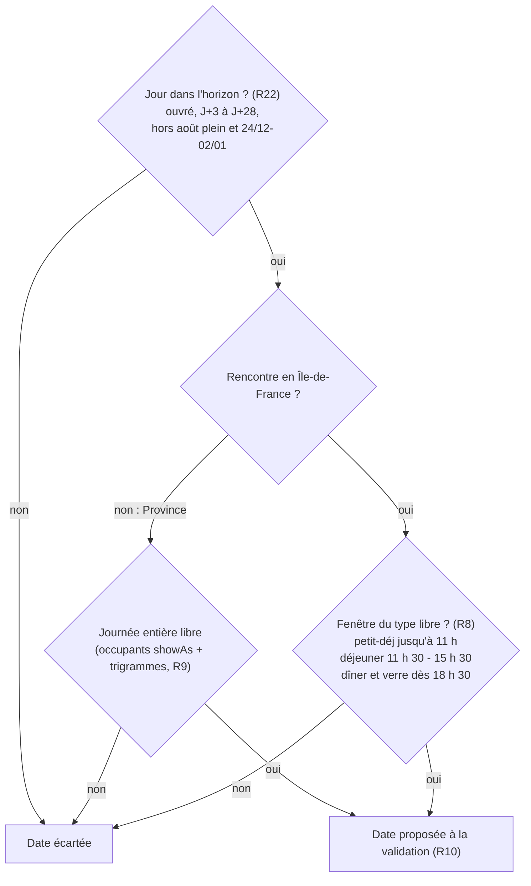
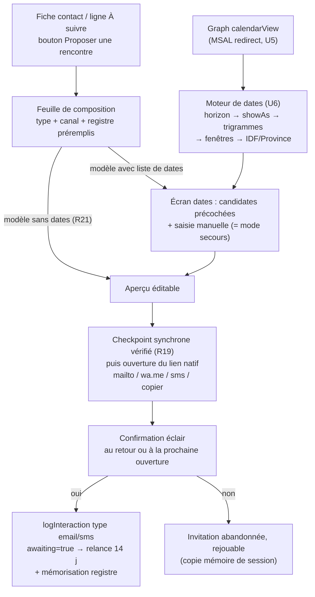
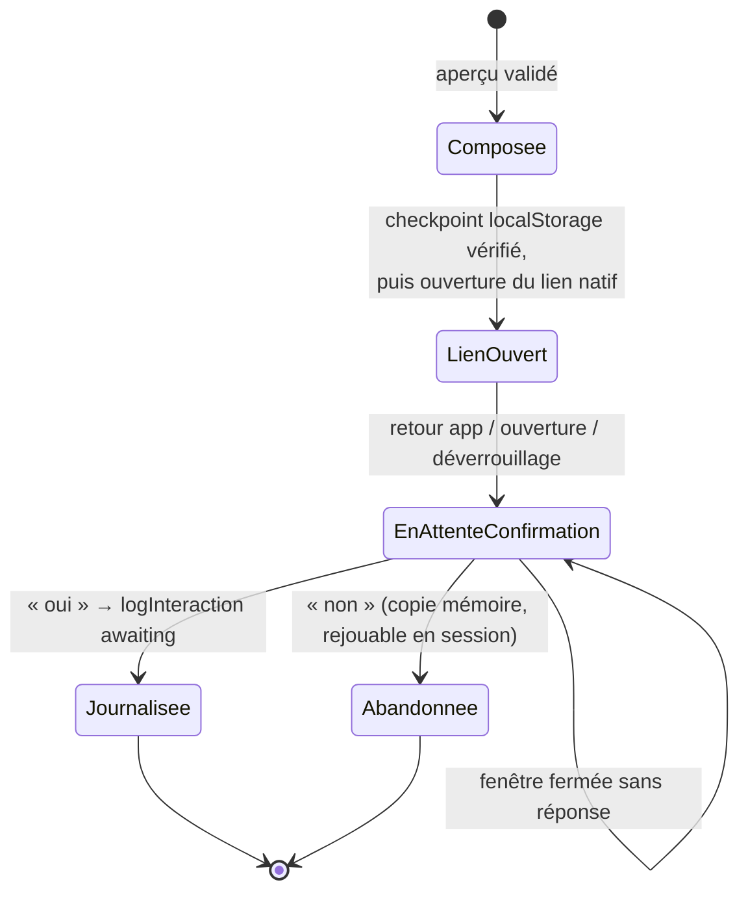
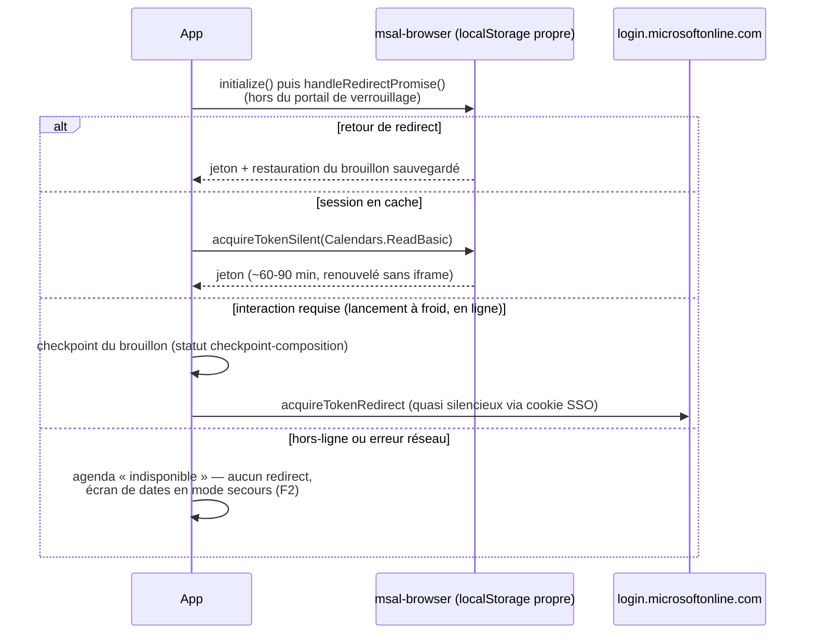

# Geste d'invitation - Plan

**Target repo :** `keepintouch` (clone frère de ce dépôt : `../keepintouch` ; https://github.com/LupUriel/keepintouch). Tous les chemins de fichiers du plan sont relatifs à ce dépôt.

## Goal Capsule

- **Objectif :** livrer dans la PWA Keep In Touch le « geste d'invitation » — un bouton « Proposer une rencontre » qui compose en moins d'une minute une invitation au ton de l'utilisateur, avec des dates tirées de son agenda Outlook, prête à partir par mail, WhatsApp ou SMS, et un suivi de réponse fiable. Ce plan possède ce seul chantier ; les chantiers voisins du tour d'horizon (rappels effectifs, synchronisation OneDrive…) ne sont pas en périmètre actif.
- **Autorité :** le Product Contract (R-IDs) fait foi sur le comportement produit ; les KTD font foi sur les mécanismes dans les limites des R qu'ils citent ; une unité d'implémentation ne prime sur aucun des deux. Les décisions marquées `session-settled` ne sont pas à rediscuter.
- **Profil d'exécution :** `execution: code`, en deux phases livrables — Phase A (U1-U4 et U7, geste complet en saisie manuelle de dates, aucune dépendance externe) puis Phase B (U5-U6, lecture de l'agenda). La Phase A se livre seule si la Phase B est retardée.
- **Conditions d'arrêt :** si le consentement admin du tenant s'avère impossible (U5), livrer la Phase A, marquer la Phase B (U5-U6) bloquée et le signaler — le mode manuel (F2) reste le chemin nominal. Si une décision `session-settled` se révèle infaisable en implémentation, s'arrêter et le rapporter plutôt que de la contourner.
- **Note de préservation du contrat produit :** clarifié sans changement de périmètre après synthèse confirmée par l'utilisateur le 2026-07-30 — AE7 corrigée (formats de liens) ; précisions R3/R18 (objet de mail), R4 (source de l'accroche), R5 (moment de mémorisation), R6 (règle mobile), R9 (statut libre/occupé), R13 (repli PC), R16 (type journalisé) ; ajouts R19-R22 et AE9-AE12 ; questions ouvertes du brainstorm résolues en place (mécanisme d'accès → KTD1 ; borne matinale → réglage par défaut ; motif trigramme → différé à l'implémentation).

---

## Product Contract

### Summary

Un bouton « Proposer une rencontre » sur la fiche contact et dans « À suivre » : l'utilisateur choisit le type (petit-déjeuner, déjeuner, dîner, verre), le canal (mail, WhatsApp, SMS) et le registre (tu/vous) ; l'app lit son agenda Outlook, en déduit des dates disponibles qu'il valide d'un geste, compose un brouillon à son ton et l'ouvre prêt à envoyer. Au retour, une confirmation éclair journalise l'invitation et arme la relance automatique à 14 jours qui existe déjà.

### Problem Frame

L'utilisateur est avocat associé d'un cabinet en droit social. Son développement d'affaires repose sur l'identification de prospects pertinents et l'entretien du lien avec les clients actuels, principalement par des déjeuners et rencontres conviviales.

Sa boucle réelle comporte trois étapes : trier ses contacts pour identifier les prioritaires ; confronter à la main son agenda Outlook pour trouver des créneaux ; rédiger un mail ou un message pour proposer la rencontre. L'application couvre bien la première étape (cycles de relance, vue « À suivre », section « Rencontres à programmer ») mais s'arrête là : les seuls liens sortants sont des `mailto:` et `tel:` nus, il n'existe ni modèle de message, ni notion de créneau, ni lecture d'agenda. Chaque invitation coûte plusieurs minutes et plusieurs bascules d'outils ; des relances identifiées comme dues restent sans invitation partie.

### Key Decisions

- **Lecture de l'agenda Outlook dès la v1.** (session-settled: user-directed — chosen over un porte-créneaux à saisie manuelle en v1 avec Outlook en v2 : pas de saisie manuelle des disponibilités, quitte à les confirmer avant envoi.) Governs R7, R10.
- **Règle des trigrammes par liste de collaborateurs.** (session-settled: user-directed — chosen over déclarer ses propres trigrammes et libérer tout le reste : prudence, un trigramme inconnu reste occupé, au prix d'un entretien de la liste.) Governs R9.
- **Confirmation éclair au retour.** (session-settled: user-directed — chosen over journalisation automatique à l'ouverture du brouillon ou journalisation manuelle : fiabilité du suivi au prix d'un tap.) Governs R16, R17, R19.
- **Jamais d'envoi automatique.** (session-settled: user-approved — l'app prépare, l'utilisateur relit et envoie depuis l'outil natif ; la relation reste sous son contrôle.) Governs R13.
- **Registre tu/vous mémorisé par contact.** (session-settled: user-approved — mémorisé après le premier envoi, modifiable à chaque invitation.) Governs R5.
- **Le « verre » rejoint les trois repas.** (session-settled: user-approved — même geste, même famille conviviale ; fenêtre horaire alignée sur le dîner.) Governs R1, R8.
- **Interrupteur « Île-de-France / Province ».** (session-settled: user-directed — libellé choisi par l'utilisateur contre « Paris / Province » : la règle repose sur les huit départements franciliens.) Governs R12.
- **Exclusions calendaires de l'horizon.** (session-settled: user-directed — semaines pleines d'août et fêtes de fin d'année exclues des propositions.) Governs R22.
- **L'app reste sans serveur propre.** La lecture d'agenda passe par le compte M365 de l'utilisateur depuis le client ; aucune donnée de contact ni d'agenda ne transite par un serveur tiers. Governs R7.

### Requirements

**Déclenchement et composition**

- R1. Le bouton « Proposer une rencontre » est accessible depuis la fiche contact et depuis chaque ligne de « Rencontres à programmer » (vue « À suivre »). Types proposés : petit-déjeuner, déjeuner, dîner, verre.
- R2. Au déclenchement, l'utilisateur choisit le type, le canal (mail, WhatsApp, SMS) et le registre (tutoiement / vouvoiement), chacun prérempli par son défaut (R5, R6).
- R3. Le brouillon est composé à partir de modèles éditables calqués sur les messages réels de l'utilisateur (voir Appendix) : mail tutoiement (voix « je », liste de dates courte en puces), mail vouvoiement (voix « nous » du cabinet, liste de dates plus fournie), WhatsApp/SMS (court, sans liste de dates, formulation souple type « la semaine prochaine »). Chaque modèle mail comporte un objet (ex. « Déjeuner ? »).
- R4. L'accroche se personnalise automatiquement : à partir de la dernière rencontre conviviale enregistrée (« depuis notre déjeuner de mars… ») ; à défaut, de la dernière interaction qui n'est pas une invitation ; à défaut, variante « premier contact » sans référence inventée.
- R5. Le registre choisi est mémorisé sur la fiche contact à la confirmation d'envoi (« oui » de R16) — pas à l'ouverture du brouillon — et reste modifiable à chaque invitation.
- R6. Le canal par défaut découle des coordonnées de la fiche : quand mail et mobile coexistent, le mail est présélectionné ; sinon WhatsApp si un mobile existe, le SMS restant sélectionnable manuellement — mobile = numéro commençant par 06 ou 07 une fois normalisé, priorité au numéro personnel puis professionnel puis à l'ancien champ unique. Un canal sans coordonnée est grisé, avec ajout direct possible depuis la feuille de composition ; la coordonnée ajoutée est enregistrée sur la fiche contact (numéro personnel ou email selon le canal) par le circuit d'enregistrement existant et reste acquise pour les invitations suivantes.

**Disponibilités et agenda**

- R7. L'app identifie les dates à proposer en lisant l'agenda Outlook (M365) de l'utilisateur ; aucune saisie manuelle des disponibilités n'est requise en usage nominal.
- R8. Une date est proposable pour un type donné quand sa fenêtre est libre : petit-déjeuner = début de matinée libre jusqu'à 11 h (début de fenêtre par défaut 8 h) ; déjeuner = libre de 11 h 30 à 15 h 30 (temps de trajet inclus) ; dîner et verre = libre à partir de 18 h 30. Les fenêtres sont ajustables dans les réglages.
- R9. Seuls les événements marqués occupé, provisoire ou absent occupent un créneau ; un événement marqué libre (anniversaire, rappel « journée entière »…) n'occupe rien. Parmi les occupants, un événement dont l'intitulé commence par un trigramme figurant dans la liste « collaborateurs » des réglages (ex. « CME », « CGI ») est traité comme libre ; tout autre occupant — sans trigramme, ou avec un trigramme non listé, y compris ceux de l'utilisateur (« US », « USA ») — laisse le créneau occupé.
- R10. Avant composition, les dates candidates sont présentées à l'utilisateur, qui les valide ou les décoche d'un geste. Ce même écran accepte la saisie manuelle de dates quand la lecture d'agenda échoue ou n'est pas connectée (mode secours).
- R11. Le nombre de dates injectées dans le brouillon suit le registre — liste courte en tutoiement (3 par défaut), plus fournie en vouvoiement — et se règle par modèle.
- R12. Un interrupteur « Île-de-France / Province », préréglé d'après l'adresse ou la localisation du contact quand un code postal est exploitable (Île-de-France = 75, 77, 78, 91, 92, 93, 94, 95 ; Île-de-France par défaut sinon), applique la règle province : seuls les jours entièrement libres sont proposés.
- R22. L'horizon des dates candidates : jours ouvrés uniquement, de J+3 à J+28 par défaut, plafonné à une dizaine de candidates, hors semaines civiles entièrement contenues dans août (une semaine qui contient au moins un jour de juillet ou de septembre reste proposable) et hors période du 24 décembre au 2 janvier inclus. Bornes et exclusions réglables.



**Envoi et suivi**

- R13. Le brouillon s'ouvre prêt à envoyer dans l'outil natif du canal (Outlook pour le mail, WhatsApp, messagerie SMS) ; l'utilisateur relit et envoie lui-même. L'app n'envoie jamais directement. Sur PC, le canal SMS est remplacé par « copier le message » et WhatsApp s'ouvre dans WhatsApp Web.
- R14. Le brouillon est prévisualisé et modifiable dans l'app avant ouverture.
- R15. Les numéros restent stockés au format national ; la conversion se fait à la construction du lien : WhatsApp = indicatif et numéro en chiffres seuls (`33612345678`), SMS = format E.164 (`+33612345678`) ; un indicatif étranger déjà présent est conservé tel quel.
- R16. Au retour dans l'app, une confirmation éclair (« Invitation envoyée à [Prénom] ? ») journalise l'invitation comme interaction du type correspondant au canal (email, SMS/WhatsApp) — jamais un type « rencontre », pour ne pas réinitialiser le cycle — marquée « en attente de réponse », ce qui arme la relance existante à 14 jours.
- R17. Si l'utilisateur répond non à la confirmation éclair, rien n'est journalisé et l'invitation reste rejouable à l'identique.

**Fiabilité du suivi**

- R19. L'invitation en cours est enregistrée localement (contact, type, canal, registre, dates, texte) dès l'ouverture du lien d'envoi. La confirmation éclair se re-présente à chaque ouverture ou déverrouillage de l'app tant qu'elle n'est pas tranchée ; fermer la fenêtre de confirmation ne vaut pas réponse. Plusieurs invitations en attente se présentent l'une après l'autre.
- R20. Tant qu'une invitation est en attente de réponse, la fiche contact et la ligne « Rencontres à programmer » affichent « invitation envoyée le [date] » ; déclencher une nouvelle invitation vers ce contact demande une confirmation préalable, sans blocage dur.
- R21. L'étape de validation des dates n'apparaît que si le modèle sélectionné contient la variable « liste de dates » ; en son absence (WhatsApp/SMS par défaut), la composition passe directement à l'aperçu.

**Modèles et réglages**

- R18. Les modèles sont éditables dans l'app (variables : prénom, accroche contextuelle, liste de dates, type de rencontre ; objet pour les mails) ; l'app est livrée avec 4-5 modèles de départ fondés sur les messages de l'Appendix.

### Key Flows

- F1. Invitation depuis « À suivre »
  - **Trigger :** l'utilisateur touche « Proposer une rencontre » sur une ligne de « Rencontres à programmer » (ou depuis une fiche contact).
  - **Steps :** choix type / canal / registre préremplis → si le modèle porte une liste de dates : calcul des candidates (agenda Outlook + R8/R9/R12/R22) puis validation d'un geste, sinon passage direct (R21) → aperçu du brouillon, modifiable → enregistrement de l'invitation en cours (R19) → ouverture dans Outlook / WhatsApp / SMS → l'utilisateur envoie → retour dans l'app → confirmation éclair → journalisation « en attente de réponse », relance à 14 jours armée.
  - **Outcome :** invitation partie et suivie sans aucune saisie hors de l'app, en moins d'une minute.
  - **Covers :** R1-R16, R19-R22.
- F2. Mode secours sans agenda
  - **Trigger :** la lecture d'agenda échoue, le consentement est absent, ou l'agenda n'a pas été connecté.
  - **Steps :** l'écran de validation des dates (R10) s'ouvre en saisie directe avec un bandeau « agenda non connecté » → la suite du flux est identique à F1.
  - **Outcome :** le geste reste utilisable de bout en bout sans connexion agenda.
  - **Covers :** R10, R13-R17, R19.

### Acceptance Examples

- AE1. **Covers R8, R9.** Given un mercredi dont le seul événement 12 h - 14 h s'intitule « CME — RDV client », est marqué occupé, et « CME » figure dans la liste collaborateurs, when déjeuner en Île-de-France, then mercredi figure dans les dates candidates.
- AE2. **Covers R9.** Given un jeudi avec un événement occupé « US — Audience » à 12 h 30, when déjeuner, then jeudi est écarté (trigramme de l'utilisateur, non listé côté collaborateurs).
- AE3. **Covers R9.** Given un vendredi avec un événement occupé « Réunion cabinet » 13 h - 14 h sans trigramme, when déjeuner, then vendredi est écarté.
- AE4. **Covers R12.** Given un contact à Lyon et un lundi libre de 11 h 30 à 15 h 30 mais avec une réunion occupée à 17 h, when déjeuner avec interrupteur sur « Province », then lundi est écarté — la journée entière doit être libre.
- AE5. **Covers R5.** Given un contact dont le registre mémorisé est « vouvoiement », when nouvelle invitation, then le modèle vouvoiement est présélectionné et reste modifiable avant composition.
- AE6. **Covers R16, R17.** Given un brouillon WhatsApp ouvert puis un retour dans l'app sans envoi, when l'utilisateur répond « non » à la confirmation éclair, then aucune interaction n'est journalisée et l'invitation est rejouable.
- AE7. **Covers R15.** Given un contact dont le mobile est stocké « 06 12 34 56 78 », when envoi, then le lien WhatsApp utilise `wa.me/33612345678` (sans « + »), le lien SMS utilise `sms:+33612345678`, et le numéro stocké reste inchangé ; un numéro « +41 79 123 45 67 » conserve son indicatif suisse.
- AE8. **Covers R4.** Given un contact sans aucune interaction enregistrée, when composition du brouillon, then l'accroche utilise la variante « premier contact » et ne fabrique aucune référence à un échange inexistant.
- AE9. **Covers R19.** Given un brouillon WhatsApp ouvert sur Android puis la PWA tuée par le système, when réouverture et déverrouillage de l'app, then la confirmation « Invitation envoyée à [Prénom] ? » se présente avant toute autre action.
- AE10. **Covers R22.** Given le mercredi 12 août 2026 libre (semaine civile entièrement en août), then il n'est jamais proposé ; given le lundi 31 août 2026 (sa semaine touche septembre), then il est proposable ; given le 28 décembre, then il est exclu.
- AE11. **Covers R9.** Given un jeudi dont le seul événement est « Anniversaire Marie », journée entière, marqué libre, when déjeuner, then jeudi est proposé.
- AE12. **Covers R20.** Given une invitation envoyée à un contact il y a 3 jours, en attente de réponse, when l'utilisateur redéclenche « Proposer une rencontre » sur ce contact, then un interstitiel « une invitation est déjà en attente » demande confirmation avant de recomposer.

### Success Criteria

- **Vitesse :** du contact identifié au brouillon ouvert dans l'outil d'envoi en moins d'une minute, sur PC comme sur mobile.
- **Volume :** le frein saute — davantage d'invitations réellement parties chaque semaine (ordre de grandeur visé : 2-3).
- **Zéro réécriture :** le brouillon part tel quel ou presque dans environ 9 cas sur 10 ; sinon, les modèles sont à retravailler.

### Scope Boundaries

Différé — chantiers voisins déjà identifiés, hors périmètre de ce plan :

- Rappels et notifications effectives (file du jour, notification nominative, rappel Outlook, témoin de fiabilité).
- Synchronisation PC↔mobile (« coffre OneDrive ») et sauvegarde continue.
- Du « oui » au rendez-vous : confirmation du créneau retenu, création de l'événement Outlook, journalisation de la rencontre tenue.
- « Machine à prétextes » : accroches adossées aux échéances sociales du secteur du contact.
- Invitations multi-contacts (déjeuner à trois ou plus) — la v1 invite un contact à la fois.

Différé — suites locales de ce chantier :

- Bouton d'invitation sur les lignes « Relances en attente » (la relance après 14 jours passe par la fiche contact en v1).
- Exclusion automatique des jours fériés français (décochables à la main sur l'écran de validation en v1).
- Ajout des nouveaux champs (registre, métadonnées d'invitation) à l'export Excel — la sauvegarde JSON les couvre déjà ; l'export Excel « forme maison » à cinq structures parallèles n'est pas touché en v1.
- Durcissement CSP (politique de sécurité de contenu stricte) — l'auto-hébergement des bibliothèques (U1) supprime déjà la dépendance CDN au runtime ; une CSP est un chantier propre, la surface visée préexiste à ce plan.

Hors identité du produit :

- Envoi automatique sans relecture : exclu durablement, pas seulement différé (voir Key Decisions).

### Dependencies / Assumptions

- **Consentement admin du tenant (unique préalable externe) :** la politique de consentement par défaut de Microsoft Entra bloque l'auto-consentement utilisateur sur les permissions calendrier, même en lecture minimale. Une approbation admin unique est requise (URL `adminconsent` — l'utilisateur est plausiblement l'admin de son petit cabinet). La Phase B en dépend ; la Phase A non.
- **Discipline des trigrammes :** les événements posés par les collaborateurs portent leur trigramme en tête d'intitulé de façon suffisamment régulière pour que R9 soit fiable ; l'écran de validation (R10) rattrape les cas irréguliers.
- **Ré-authentification au lancement à froid :** le cache de session Microsoft ne survit pas à la fermeture complète de la PWA ; un aller-retour de connexion quasi silencieux (cookie de session Microsoft persistant) se produit alors. Accepté ; l'invitation en cours est sauvegardée avant tout aller-retour (R19).
- **Posture de sécurité (énoncé honnête du modèle de menace) :** le verrou par mot de passe de l'app est un portail d'interface, pas un chiffrement — quiconque accède au profil navigateur lit l'intégralité du localStorage, verrou ou pas, ce qui vaut déjà aujourd'hui pour tout le fichier de contacts. L'exposition ajoutée par le jeton Microsoft est matériellement inférieure à l'exposition existante : périmètre `Calendars.ReadBasic` seulement (jamais le corps des événements), jetons à durée bornée (~1 h, refresh 24 h max), cache chiffré ne survivant pas à la fermeture. Mitigations proportionnées déjà dans le plan : permission minimale (KTD1), bouton de déconnexion qui purge le cache (U5), cache hors sauvegardes (KTD5). Les brouillons persistés (`pendingInvites`) sont moins sensibles que les notes d'interactions déjà stockées au même endroit — protection identique, assumée.
- **Comportements existants conservés :** la relance à 14 jours ne tient que tant que l'invitation reste la dernière interaction du contact (sémantique actuelle des « Relances en attente ») ; une invitation ne lève pas un snooze en cours (seule une rencontre journalisée le fait).
- **Données locales par appareil :** modèles, réglages et invitations journalisées sur un appareil ne se propagent pas à l'autre tant que le chantier synchronisation n'est pas livré — limitation connue, assumée pour la v1.

<!-- ce-section: work-relationships -->
### How This Work Fits Together

Ce plan possède le geste d'invitation. Le découpage ci-dessous reflète la compréhension actuelle issue du tour d'horizon du 2026-07-29 (35 idées générées, 14 retenues et classées) — c'est un éclairage, pas une feuille de route engagée ; un plan ultérieur peut le réviser.

- Rappels effectifs (file du jour, notification nominative, rappel Outlook, témoin de fiabilité ; push serveur seulement si la mesure l'exige)
  - Can proceed independently of ce plan, mais chaque rappel doit déboucher sur le geste d'invitation pour être actionnable — ce plan le rend possible.
- Coffre OneDrive (synchronisation PC↔mobile)
  - Shares avec ce plan le tenant M365 du cabinet ; prérequis de crédibilité des rappels multi-appareils.
- Du « oui » au rendez-vous
  - Depends on ce plan (prolonge F1 après la réponse du contact ; les métadonnées d'invitation journalisées par U4 le préparent — sous l'invariant d'immutabilité des entrées, KTD4).
- Machine à prétextes (échéances sociales comme accroches)
  - Depends on les modèles de ce plan (R18) ; s'y branche sans changer le socle.
- Quick wins indépendants : filet de sécurité PC (sauvegarde continue), « un tap = déjeuner enregistré », témoin de fiabilité des rappels
  - Can proceed independently.
- Still to decide : l'ordre exact des vagues suivantes, à réévaluer après la mise en usage réel de ce plan.

### Sources / Research

- Code de l'app : `index.html` — types d'interaction et types « rencontre » (l. 103-123), cycles de relance (l. 260-265, 617-623), mécanisme « en attente de réponse » (l. 533-549, 942), `logInteraction` et ses effets de bord (l. 938-952), liens sortants (l. 2093-2121), `normalizePhone` au format national (l. 1374-1388), pattern modal (`renderLogModal` l. 1749-1789, ouverture l. 983), panneaux du menu « ⋯ » (l. 2494-2571), `save()` et miroir IndexedDB (l. 808-815), `migrateData` (l. 140-158), moteur de fusion (l. 159-224), `MERGE_FIELDS` (l. 130), import Excel sans mise à jour des contacts existants (l. 1499-1518), vue « À suivre » (l. 2188-2321), scripts CDN (l. 22-26), verrou (l. 30-59) ; `sw.js` — handler fetch cache-first à restreindre (l. 24-37), purge des caches à l'activation (l. 12-22), `CACHE_NAME` (l. 1).
- Microsoft : politique de consentement par défaut excluant les permissions calendrier de l'auto-consentement (learn.microsoft.com/entra/identity/enterprise-apps/manage-app-consent-policies) ; `calendarView` et permission minimale `Calendars.ReadBasic` (learn.microsoft.com/graph/api/user-list-calendarview) ; contraintes SPA — jetons 24 h, échec des iframes sous blocage des cookies tiers, redirect recommandé sur mobile (learn.microsoft.com/entra/identity-platform/reference-third-party-cookies-spas ; FAQ msal-browser) ; CDN Microsoft abandonné — bundle `msal-browser.min.js` v5 auto-hébergé (learn.microsoft.com/entra/msal/javascript/browser/cdn-usage) ; cache MSAL chiffré ne survivant pas à la fermeture (doc caching msal-browser, issues #7611/#7935) ; retrait d'EWS (blocage oct. 2026) ; événements « journée entière » et fuseau (learn.microsoft.com Q&A). Formats de liens : wa.me (faq.whatsapp.com/5913398998672934), `sms:?body`/`&body` selon plateforme.
- Les trois messages réels fournis par l'utilisateur (Appendix) sont la matière première des modèles R3/R18.

---

## Planning Contract

### Key Technical Decisions

- KTD1. **Lecture d'agenda par Microsoft Graph depuis la SPA, avec msal-browser v5 auto-hébergé et flux redirect ; permission `Calendars.ReadBasic`.** Instancie la décision produit « Lecture de l'agenda Outlook dès la v1 » (session-settled: user-directed) ; cite R7, R10. Les appels vont directement du navigateur à Graph (CORS natif, aucun proxy) : rien ne transite par Netlify ni un tiers. `ReadBasic` expose intitulé, horaires, statut libre/occupé et « journée entière » — tout ce qu'exige R9 — sans jamais donner accès au corps des événements. Alternatives rejetées : calendrier publié ICS (pas de CORS → proxy obligatoire faisant transiter les intitulés par Netlify ; fraîcheur multi-heures ; publiable désactivable par le tenant) ; EWS (bloqué par Microsoft à partir d'octobre 2026). Le bundle `lib/msal-browser.min.js` (UMD, global `msal`) est téléchargé une fois et commité — l'app ne doit pas dépendre d'un CDN tiers au runtime, principe que U1 étend aux cinq bibliothèques déjà chargées depuis unpkg/cdnjs. Redirect plutôt que popup : les popups sont explicitement déconseillées en PWA installée et sur mobile.
- KTD2. **Livraison en deux phases.** Phase A = geste complet avec dates saisies à la main (U1-U4, U7) ; Phase B = calendrier (U5-U6). Le seul risque externe du projet (consentement admin du tenant) est isolé en Phase B et validé par un spike avant d'y investir ; la valeur du geste arrive sans lui.
- KTD3. **Invitation en attente persistée dans `data` (nouvelle clé `pendingInvites`), re-présentée à chaque ouverture jusqu'à résolution.** (session-settled: user-approved — chosen over une détection du retour par événement de visibilité seule : Android tue fréquemment la PWA quand WhatsApp passe au premier plan, et le PC n'a aucun événement « retour » fiable.) Cite R19, R17. L'écriture du checkpoint est synchrone (localStorage) et vérifiée par relecture **avant** tout déclenchement de navigation — le miroir IndexedDB est asynchrone et peut ne pas aboutir si Android tue l'app. `pendingInvites` suit le régime de `data` (miroir IndexedDB, sauvegardes JSON, aucune donnée d'authentification) mais est **strictement locale à l'appareil** : la restauration et la fusion ne la réappliquent jamais — sinon l'autre appareil présenterait des confirmations fantômes et journaliserait des doublons. « Non » supprime la persistance et conserve une copie en mémoire pour un rejeu immédiat dans la même session (cohérent avec R17 : rien ne reste persisté). Fermer la fenêtre ≠ répondre. Ce même point de sauvegarde sert de checkpoint avant les allers-retours d'authentification (KTD1) — chaque entrée porte donc un statut : `checkpoint-composition` (sauvegarde avant un aller-retour d'authentification, restaurée dans la feuille de composition au retour, jamais présentée en confirmation) ou `lien-ouvert` (seul statut qui déclenche la confirmation éclair et sa re-présentation).
- KTD4. **Journalisation par le `logInteraction` existant, types non-rencontre.** Cite R16. Canal mail → type `email`, WhatsApp/SMS → type `sms` : aucun des deux n'appartient à `RENCONTRE_TYPES`, donc ni réinitialisation du cycle de 12 mois ni levée de snooze ; `awaitingResponse=true` arme la relance à 14 jours sans nouveau mécanisme. Les métadonnées d'invitation (type de rencontre, dates proposées, canal) sont portées par l'entrée d'interaction — les entrées fusionnent déjà objet entier par `iid`, zéro changement du moteur de fusion. **Invariant nommé : une entrée d'interaction est immuable après création ; tout enrichissement ultérieur passe par une nouvelle entrée.** C'est la condition de validité du dédoublonnage premier-vu-gagne par `iid`, et une contrainte léguée au chantier « du oui au rendez-vous ».
- KTD5. **Réglages et modèles dans l'objet `data` ; jetons Microsoft hors de `data`.** Cite R18, R22. `data.settings` et `data.templates` sont couverts d'office par `save()`, le miroir IndexedDB et la sauvegarde JSON. Sémantique précise : les valeurs par défaut sont semées dans `migrateData` (idempotent — couvre d'un coup chargement, restauration et fusion) ; la restauration ne réapplique `settings`/`templates` que s'ils sont **présents** dans le fichier — restaurer une sauvegarde antérieure à cette version ne les efface jamais ; la fusion suit un horodatage last-write-wins porté par l'objet `settings` et par chaque modèle, tout écrasement étant signalé dans le rapport de fusion existant ; les valeurs semées portent l'horodatage de base du moteur de fusion (pattern existant de `migrateData`), pour qu'une édition réelle gagne toujours contre des défauts fraîchement semés. Le cache MSAL reste dans son localStorage propre : jamais dans `data`, jamais dans une sauvegarde.
- KTD6. **Service worker restreint aux GET même-origine — prérequis de toute intégration réseau.** Le handler actuel intercepte tout : il mettrait les réponses Graph en cache (problème de confidentialité) et retournerait `index.html` en réponse aux POST de jetons (bug garanti). Early-return sur méthode ≠ GET ou origine ≠ propre origine. **Préalable obligatoire :** l'auto-hébergement des bibliothèques (U1) — aujourd'hui le démarrage hors-ligne ne tient que parce que le SW met les scripts CDN en cache ; restreindre sans auto-héberger casserait l'app en mode avion.
- KTD7. **Vérification smoke-first : fonctions pures + harnais léger + checklists manuelles.** L'app est un fichier unique sans build ni infrastructure de test. La logique à risque (éligibilité des dates, trigrammes, normalisation des numéros, rendu des modèles) est écrite en fonctions pures regroupées, exercées par un harnais d'assertions exécutable dans la console (`KIT_TESTS.run()`) ; le harnais est écrit en JavaScript pur dans un script **non-Babel** pour ne pas taxer la compilation de chaque démarrage à froid. Le reste se vérifie par checklists manuelles PC + Android par phase.
- KTD8. **Normalisation des numéros et construction des liens à l'envoi seulement.** Cite R15. Le stockage reste au format national (comportement actuel de `normalizePhone` conservé) ; la conversion vers `33…` (WhatsApp) ou `+33…` (SMS) se fait à la construction du lien, en préservant un indicatif étranger existant ; séparateur du corps `sms:` choisi selon la plateforme (`?body` Android, `&body` iOS). **Règle d'encodage : toute valeur variable — adresse, objet, corps, texte — passe par `encodeURIComponent` à la construction du lien ; seuls les numéros normalisés s'insèrent en clair.** Le pattern existant de concaténation nue (`"mailto:" + c.email`) ne doit pas être imité.

### High-Level Technical Design

Chaîne du geste (Phase A complète ; la Phase B remplace la saisie manuelle par le moteur de dates) :



Cycle de vie d'une invitation en attente (KTD3) :



Authentification au chargement (KTD1 — l'aller-retour redirect est un événement de routine, pas un cas d'erreur) :



### System-Wide Impact

- **Le service worker change de contrat pour toute l'app.** Le démarrage hors-ligne actuel ne tient que parce que le handler met les cinq scripts CDN (React, ReactDOM, Babel, xlsx, exceljs) en cache ; la restriction même-origine (KTD6) combinée à la purge des anciens caches au bump de `CACHE_NAME` les rendrait indisponibles hors connexion — page blanche en mode avion. D'où l'auto-hébergement préalable de U1, qui aligne du même coup l'app sur le principe déjà posé par KTD1 et réduit la surface d'attaque CDN.
- **Première navigation programmatique de l'app.** Les seuls liens sortants actuels sont des ancres. Le flux « checkpoint puis ouverture » impose un handler de clic : `mailto:` et `sms:` naviguent par schéma sans décharger la page ; `wa.me` est une URL https qui doit s'ouvrir par `window.open` appelé synchroniquement dans le clic (sinon déchargement de la SPA ou blocage popup). La persistance localStorage précède toujours le déclenchement (KTD3).
- **Deux consommateurs de `visibilitychange` et deux traversées du verrou.** Le listener existant lance la vérification de mise à jour du SW à chaque retour au premier plan ; le nouveau re-présente les confirmations. Le toast « Nouvelle version » (z-index 60) passe sous les modales et son « Recharger » peut interrompre une confirmation — sans perte grâce à la persistance KTD3 ; cas couvert par la checklist Phase A. Côté verrou : `initialize()`/`handleRedirectPromise()` s'exécutent hors du portail de verrouillage (le retour de redirect recharge la page), la confirmation éclair attend le déverrouillage (AE9).
- **Échelle z-index étendue.** Trois couches superposables sont introduites : feuille de composition 1000, interstitiel anti-double 1010, confirmation éclair 1020 (inventaire existant : menu 40/50, toast 60, fusion 80, nav basse 900, log modal 1000).
- **Budget du fichier unique.** `index.html` (~2 800 lignes) est intégralement compilé par Babel-standalone à chaque démarrage à froid ; le chantier ajoute de l'ordre d'un millier de lignes. Le temps de démarrage sur l'Android réel est mesuré avant la Phase A (référence) et re-mesuré après la Phase B ; le harnais de test reste hors compilation Babel (KTD7).

### Output Structure

```text
keepintouch/
├── index.html          (modifié — tout le code applicatif)
├── sw.js               (modifié — handler restreint, précache lib/, CACHE_NAME bumpé)
├── lib/                (nouveau — bibliothèques auto-hébergées, versions épinglées)
│   ├── react.production.min.js
│   ├── react-dom.production.min.js
│   ├── babel.min.js
│   ├── xlsx.full.min.js
│   ├── exceljs.min.js
│   └── msal-browser.min.js
└── LISEZMOI.txt        (complété — enregistrement Entra, consentement admin)
```

L'arborescence est une déclaration de forme, pas une contrainte ; les listes `Files` de chaque unité restent l'autorité.

### Sequencing

- **Phase A (aucune dépendance externe) :** U1 → U2 → U3 → U4 → U7 (l'écran de dates fonctionne en saisie manuelle ; le moteur U6 s'y branchera en Phase B). Livrable seule.
- **Phase B :** U5 (dont le spike de consentement, à faire en tout premier — l'enregistrement Entra ne touche pas au code et peut démarrer pendant la Phase A) → U6.
- Chaque livraison bump `CACHE_NAME` (`sw.js`) et `APP_VERSION` (`index.html`) dans le même commit, sinon les appareils ne reçoivent jamais la mise à jour (cache-first sur `index.html`).

### Deferred to implementation

- Motif exact de reconnaissance d'un trigramme en tête d'intitulé (défaut : 2 à 4 lettres majuscules suivies d'un séparateur espace/tiret/deux-points ; la liste réglée fait foi ; à ajuster sur l'agenda réel lors du spike U5).
- Texte définitif des 4-5 modèles de départ (base : Appendix ; objet des mails inclus).
- Forme exacte de l'écran dates (chips précochées selon le pattern existant vs liste) — à trancher au premier essai réel sur mobile.

---

## Implementation Units

### U1. Auto-héberger les bibliothèques et sécuriser le service worker

- **Goal :** supprimer la dépendance CDN au runtime, puis restreindre l'interception réseau aux GET même-origine — prérequis de tout appel Graph/MSAL, sans casser le démarrage hors-ligne.
- **Requirements :** KTD6 ; prérequis réseau de R7.
- **Dependencies :** aucune.
- **Files :** `lib/react.production.min.js`, `lib/react-dom.production.min.js`, `lib/babel.min.js`, `lib/xlsx.full.min.js`, `lib/exceljs.min.js` (nouveaux, versions épinglées), `index.html`, `sw.js`.
- **Approach :**
  1. Télécharger les cinq bundles UMD en versions épinglées (celles servies aujourd'hui par les plages semver des CDN) depuis le tarball npm officiel ou son miroir jsdelivr, vérifier le hash de chaque bundle contre le champ `integrity` du registre npm avant commit, consigner versions et hashes dans `lib/VERSIONS.txt`, les committer dans `lib/`, remplacer les `<script src>` CDN d'`index.html`.
  2. Restreindre le handler `fetch` de `sw.js` : early-return quand la méthode n'est pas GET ou que l'origine de la requête n'est pas celle du service worker.
  3. S'assurer que `lib/` est couvert par le cache du SW (précache ou cache au premier GET même-origine).
  4. Bump de `CACHE_NAME` et d'`APP_VERSION` dans le même commit ; vérifier la chaîne de mise à jour (toast « Nouvelle version disponible »).
- **Patterns to follow :** handler existant `sw.js:24-37` ; chaîne de mise à jour `index.html:2774-2792` ; inclusion de scripts `index.html:22-26`.
- **Test scenarios :**
  - Démarrage à froid en mode avion après un premier chargement en ligne (PWA tuée puis relancée) : l'app démarre — sur PC et sur Android.
  - Une requête vers un domaine externe (simulée en console) n'est ni interceptée ni écrite dans Cache Storage.
  - Un POST ne reçoit jamais `index.html` en réponse.
  - Export Excel et import fonctionnent à l'identique avec les bibliothèques auto-hébergées (xlsx/exceljs épinglés).
  - Après déploiement, les deux appareils reçoivent le toast de mise à jour et la nouvelle version s'affiche dans « À propos ».
- **Verification :** mode avion réel concluant sur les deux appareils ; Cache Storage inspecté — aucune entrée hors même-origine ; hashes de `lib/` conformes à `lib/VERSIONS.txt` ; temps de démarrage à froid mesuré sur l'Android réel (référence pour la suite).

### U2. Réglages, modèles et registre — données et écran

- **Goal :** créer le socle de configuration : réglages, modèles de message, champ registre par contact, panneau de réglages — avec une sémantique de migration, restauration et fusion explicite.
- **Requirements :** R3, R5 (champ), R8 (valeurs des fenêtres), R9 (liste trigrammes), R12 (défaut IDF), R18, R22 (bornes et exclusions) ; KTD5.
- **Dependencies :** U1 (pour livrer).
- **Files :** `index.html`.
- **Approach :**
  1. `data.settings` : liste de trigrammes collaborateurs, fenêtres par type (petit-déj 8 h → 11 h ; déjeuner 11 h 30 → 15 h 30 ; dîner/verre 18 h 30 → fin de soirée), horizon (min J+3, max J+28, plafond 10), exclusions (août plein : semaine civile sans jour de juillet ni septembre ; 24/12 → 02/01) — plus un horodatage `updatedAt` porté par l'objet.
  2. `data.templates` : 4-5 modèles de départ depuis l'Appendix (objet inclus pour les mails, variables prénom/accroche/dates/type), éditables, chacun avec son `updatedAt` et son nombre de dates injectées (3 pour les modèles tutoiement, 8 pour vouvoiement — R11).
  3. Les valeurs par défaut de `settings`/`templates` sont semées dans `migrateData` (idempotent) — le point de passage unique du chargement, de la restauration et des deux côtés de la fusion — avec l'horodatage de base du moteur de fusion (`TS_BASE`, pattern `index.html:146`), cite KTD5.
  4. Champ `register` sur le contact + ajout à `MERGE_FIELDS` (`index.html:130`) pour la fusion horodatée par champ.
  5. Panneau « ⚙ Rencontres & agenda » dans le menu « ⋯ », sur le pattern des panneaux existants.
  6. Restauration et fusion : `settings`/`templates` ne sont réappliqués que s'ils sont présents dans le fichier (une sauvegarde antérieure à la version ne les efface jamais) ; fusion last-write-wins par `updatedAt`, écrasement signalé dans le rapport de fusion existant (cite KTD5).
  7. Export Excel non touché — rationale : l'import ne met jamais à jour un contact existant (doublons ignorés, `index.html:1499-1518`) et reconnaît les colonnes par en-tête, donc un vieil Excel ne peut pas blanchir `register` ; l'export porte cinq structures couplées par position, à ne pas étendre en v1. Les contacts créés par import n'ont pas de `register` → le défaut s'applique (voulu).
- **Patterns to follow :** panneaux inline du menu « ⋯ » (`index.html:2513-2571`) ; `save()` fusionnant (`index.html:808-815`) ; `migrateData` (`index.html:140-158`) ; conventions `var` + fonctions déclarées, JSX `{"…"}` pour le texte accentué.
- **Test scenarios :**
  - Réglages et modèles persistés après rechargement complet (localStorage + miroir IndexedDB).
  - Restaurer une sauvegarde **antérieure à cette version** (sans `settings`/`templates`) : réglages et modèles courants intacts.
  - Restaurer une sauvegarde qui les contient : ils sont réappliqués (rollback assumé).
  - Fusion croisée : modèle retravaillé sur PC contre export mobile plus ancien → le plus récent gagne, ligne visible dans le rapport de fusion.
  - `register` modifié sur un appareil gagne la fusion contre une valeur plus ancienne (horodatage par champ).
  - Défauts semés sur l'appareil B après une édition réelle sur A → l'édition de A gagne la fusion (horodatage de base sur les défauts).
  - Import Excel/CSV existant inchangé (aucune colonne nouvelle attendue ; contacts existants jamais modifiés par l'import).
- **Verification :** panneau visible et éditable ; le fichier de sauvegarde JSON contient `settings` et `templates` ; les scénarios de restauration ancienne/récente passent.

### U3. Feuille de composition et moteur de modèles

- **Goal :** le geste complet du bouton jusqu'à l'ouverture du lien natif, dates fournies manuellement.
- **Requirements :** R1, R2, R3, R4, R5 (présélection), R6, R11, R13, R14, R15, R21 ; AE5, AE7, AE8 ; KTD8.
- **Dependencies :** U2.
- **Files :** `index.html`.
- **Approach :**
  1. Bouton « Proposer une rencontre » : sur la fiche contact (zone des liens sortants, `index.html:2093-2121`) et sur chaque ligne « Rencontres à programmer » (pattern du bouton « Enregistrer » `index.html:2274` avec `stopPropagation`).
  2. Modal de composition sur le pattern `openLogModal`/`renderLogModal` (état plat dans `App`, overlay `zIndex` 1000, carte défilante `maxHeight 84vh`) : étape type/canal/registre en chips préremplies, étape dates (présente seulement si le modèle porte la variable liste de dates, R21 — alimentée par U7, saisie manuelle en attendant), aperçu en `textarea` éditable (R14) — jamais de rendu HTML des modèles : la surface XSS interne de l'app reste nulle (aucun `innerHTML` aujourd'hui).
  3. Moteur de rendu de modèle en fonction pure : variables prénom, accroche (règle de source R4 : dernière rencontre conviviale via `lastRencontre`, sinon dernière interaction non-invitation, sinon variante premier contact), liste de dates au format « Mercredi 17 juin 2026 » en puces, type de rencontre.
  4. Liens de canal — mécanisme d'ouverture par canal (cite System-Wide Impact) : `mailto:` et `sms:` par navigation de schéma (ne déchargent pas la page) ; `wa.me` par `window.open` appelé synchroniquement dans le handler de clic. Objet et corps `mailto:` encodés avec garde-fou de longueur (~1 800 caractères → proposition de copier) ; `wa.me` en chiffres seuls ; `sms:` en E.164 avec séparateur selon plateforme ; sur PC, SMS remplacé par « copier le message » (`navigator.clipboard.writeText` — première utilisation du presse-papiers dans l'app) et note WhatsApp Web. Toute valeur variable passe par `encodeURIComponent` (KTD8).
  5. Règle mobile R6 : détection 06/07 après normalisation, priorité perso > pro > champ legacy ; canal sans coordonnée grisé avec champ d'ajout inline, la valeur ajoutée étant écrite sur la fiche contact (per R6) par le circuit d'enregistrement existant.
  6. Créer le harnais `KIT_TESTS` (script non-Babel dans `index.html` : `register()`/`run()`, assertions en console — KTD7) et y enregistrer dès U3 le rendu des modèles, la normalisation des numéros et l'encodage des liens ; U4 et U6 y enregistrent ensuite leurs fonctions.
- **Patterns to follow :** chips du log modal (`index.html:1760-1768`) ; tokens de style locaux `ac`/`abl`/`bd` (`index.html:1707-1711`) ; échelle z-index du plan (composition 1000 — voir System-Wide Impact). Ne pas imiter la concaténation nue des liens existants (`index.html:2096`).
- **Test scenarios :**
  - Rendu du modèle tutoiement avec 3 dates → puces « Mercredi 17 juin 2026 ; Mardi 23 juin 2026… », accroche et prénom corrects.
  - Covers AE8. Contact vierge → variante premier contact, aucune référence inventée.
  - Contact dont la dernière interaction est une invitation → l'accroche cite la dernière rencontre conviviale, pas « notre email » (R4).
  - Covers AE7. « 06 12 34 56 78 » → `wa.me/33612345678` et `sms:+33612345678` ; « +41 79 123 45 67 » conservé tel quel.
  - Contact prénommé « Anne & Cie » et message avec retour à la ligne → liens `wa.me`/`mailto:` ouverts avec texte intact, aucun paramètre parasite (KTD8).
  - `wa.me` s'ouvre par `window.open` sans décharger l'app : au retour, l'état de composition est intact.
  - Covers AE5. Registre mémorisé « vous » → modèle vouvoiement présélectionné, modifiable.
  - Canal mail grisé sans email ; WhatsApp/SMS grisés sans mobile 06/07 ; ajout inline puis canal activé.
  - Coordonnée ajoutée inline → présente sur la fiche contact après réouverture ; canal actif à l'invitation suivante sans ressaisie.
  - Contact avec email ET mobile → canal mail présélectionné (R6).
  - Modèle WhatsApp sans variable dates → aucune étape dates (R21).
  - Corps vouvoiement dépassant le garde-fou `mailto:` → bascule proposée vers « copier le message ».
- **Verification :** sur Android réel, WhatsApp s'ouvre prérempli ; sur PC, Outlook s'ouvre avec objet et corps ; chrono bouton → brouillon ouvert < 1 minute.

### U4. Invitation en attente et confirmation éclair

- **Goal :** fiabiliser la journalisation et le suivi de réponse, y compris quand la PWA est tuée pendant l'envoi.
- **Requirements :** R16, R17, R19, R20 ; AE6, AE9, AE12 ; KTD3, KTD4.
- **Dependencies :** U3.
- **Files :** `index.html`.
- **Approach :**
  1. `data.pendingInvites` : écrite juste avant l'ouverture du lien natif (contact, type de rencontre, canal, registre, dates proposées, texte final). L'écriture localStorage est **vérifiée par relecture** avant de déclencher la navigation ; en cas d'échec (quota, mode privé), avertir l'utilisateur et ne pas ouvrir le lien — `save()` avale ses erreurs en silence, ce chemin-ci ne le tolère pas (cite KTD3).
  2. Re-présentation : au montage de l'app après déverrouillage et sur `visibilitychange` (nouveau listener, coexistant avec celui de la mise à jour SW `index.html:2787-2789` — le scénario « toast de mise à jour pendant une confirmation » est couvert par la persistance) ; plusieurs invitations en attente se présentent successivement (R19).
  3. « Oui » → `logInteraction` avec type `email` ou `sms` selon canal, commentaire du type « Invitation déjeuner — mail », `awaitingResponse=true` ; métadonnées d'invitation portées par l'entrée (immuable ensuite, KTD4) ; mémorisation du registre sur la fiche (R5). « Non » → suppression de la persistance, copie mémoire conservée pour rejeu immédiat dans la même session (R17, KTD3). Fermeture de la fenêtre → l'invitation reste en attente.
  4. La restauration et la fusion ignorent `pendingInvites` (cite KTD3) — jamais de confirmation fantôme venue d'un autre appareil.
  5. Badge « invitation envoyée le [date] » sur la fiche et la ligne « Rencontres à programmer », dérivé de la dernière interaction `awaitingResponse` active ; interstitiel de confirmation avant toute recomposition (R20). Échelle z-index : interstitiel 1010, confirmation éclair 1020.
- **Patterns to follow :** `logInteraction` et ses effets (`index.html:938-952`) ; badge existant de la nav (`index.html:2696`).
- **Test scenarios :**
  - Covers AE9. `pendingInvite` survit à un rechargement complet ; la confirmation se présente après déverrouillage, avant toute autre action.
  - Échec d'écriture simulé (quota saturé) → avertissement affiché, lien non ouvert, aucune invitation fantôme.
  - Covers AE6. « Non » → aucune interaction créée ; « rejouer » restaure le même brouillon dans la même session ; après rechargement, plus de trace.
  - « Oui » → interaction type `email`, `awaitingResponse=true` ; avec une fixture datée à J-14, le contact apparaît dans « ⚠ Relances en attente ».
  - Le type journalisé n'appartient jamais à `RENCONTRE_TYPES` : `lastRencontre` inchangé, `snoozedUntil` inchangé (fixture avec contact snoozé).
  - Restaurer une sauvegarde contenant une `pendingInvite` d'un autre appareil → aucune confirmation ne s'affiche.
  - Toast de mise à jour pendant une confirmation en attente → après « Recharger », la confirmation se re-présente (persistance).
  - Covers AE12. Redéclenchement pendant l'attente → interstitiel, choix continuer/annuler.
  - Deux invitations en attente → confirmations présentées l'une après l'autre.
  - Le registre n'est mémorisé qu'au « oui », pas à l'ouverture du brouillon.
- **Verification :** cycle de 12 mois non réinitialisé sur fixture ; badge visible sur fiche et ligne ; scénario « app tuée » rejoué sur Android réel.

### U5. Enregistrement Entra et authentification Microsoft

- **Goal :** obtenir de façon fiable un jeton `Calendars.ReadBasic` sur PC et sur la PWA Android installée — et valider le tenant avant d'investir dans U6.
- **Requirements :** R7 ; KTD1 ; dépendance « consentement admin » des Dependencies/Assumptions.
- **Dependencies :** U1 ; U2 pour le bloc de réglages « Connecter mon agenda » (étape 5). L'enregistrement Entra et le spike de consentement (étapes 1-2) ne touchent pas au code et peuvent démarrer en parallèle de la Phase A.
- **Files :** `lib/msal-browser.min.js` (nouveau), `index.html`, `sw.js` (précache + bump).
- **Approach :**
  1. Enregistrement Entra : plateforme **SPA** (pas « Web »), mono-tenant, permission déléguée `Calendars.ReadBasic`, aucun secret. URIs de redirection autorisées : l'URL Netlify de production exacte + `http://localhost:<port>` pour le développement local — **jamais de wildcard, jamais de domaine Deploy Preview, même temporairement**.
  2. Consentement admin une fois : `https://login.microsoftonline.com/<tenant>/adminconsent?client_id=…` (l'utilisateur est plausiblement l'admin ; sinon, demande au prestataire IT du cabinet).
  3. Bundle msal-browser v5 (`lib/msal-browser.min.js`, UMD global `msal`) commité — hash vérifié contre le champ `integrity` du registre npm et consigné dans `lib/VERSIONS.txt` —, inclus par `<script src>` **avant** le script Babel.
  4. `initialize()` puis `handleRedirectPromise()` au chargement, **hors du portail de verrouillage** (le retour de redirect est un rechargement complet qui traverse le verrou) ; la confirmation éclair, elle, attend le déverrouillage (cite System-Wide Impact). `acquireTokenSilent` → sur `InteractionRequiredAuthError`, checkpoint du brouillon en cours (statut `checkpoint-composition`, KTD3) puis `acquireTokenRedirect` ; restauration dans la feuille de composition au retour. **La chaîne d'authentification ne bloque jamais le démarrage** : hors-ligne ou sur erreur réseau (non-interactive) d'`acquireTokenSilent`, aucun redirect n'est déclenché — l'agenda passe à l'état « indisponible » et l'écran de dates s'ouvre en mode secours (F2) ; le redirect interactif n'est tenté qu'en ligne.
  5. Réglages : bloc « Connecter mon agenda » dans le panneau U2 (état connecté avec compte affiché, bouton déconnexion qui **purge le cache MSAL** — pas seulement l'état d'affichage).
  6. Cache MSAL dans son localStorage propre — jamais dans `data`, jamais dans les sauvegardes (KTD5) ; la ré-authentification par redirect à chaque lancement à froid est un comportement accepté (quasi silencieuse via le cookie SSO persistant).
- **Execution note :** valider le consentement du tenant en tout premier — un spike minimal (obtenir un jeton, appeler `calendarView` sur une journée, afficher le nombre d'événements) suffit et se fait avant d'écrire U6. En profiter pour observer le motif réel des trigrammes et les événements « journée entière » de l'agenda de l'utilisateur.
- **Test scenarios :**
  - Premier login : aller-retour redirect, jeton obtenu, compte visible dans les réglages.
  - Lancement à froid de la PWA installée : redirect sans saisie de mot de passe, brouillon en cours restauré après le retour.
  - Déconnexion → état déconnecté **et aucune clé `msal.*` restante dans localStorage** ; le geste reste entièrement fonctionnel en mode manuel (F2).
  - Après un retour de redirect, Cache Storage ne contient aucune URL portant `code=` (le code revient en fragment, invisible du service worker — vérification que ce comportement tient).
  - URL non enregistrée (Deploy Preview Netlify) → échec propre avec message clair, pas de boucle de redirects.
  - Redirect d'authentification en cours de composition → brouillon restauré dans la feuille de composition, **aucune** confirmation « envoyée ? » affichée (statut `checkpoint-composition`).
  - Lancement à froid en mode avion, agenda déjà connecté → app utilisable, bandeau « agenda non connecté », aucun redirect déclenché.
- **Verification :** jeton silencieux en session < 1 s ; aucune donnée d'agenda dans Cache Storage (grâce à U1) ; rien de MSAL dans une sauvegarde JSON.

### U6. Moteur de dates candidates

- **Goal :** calculer les dates proposables depuis l'agenda, en fonctions pures testées.
- **Requirements :** R8, R9, R12, R22 ; AE1-AE4, AE10, AE11 ; KTD1, KTD7.
- **Dependencies :** U5 (jeton), U2 (réglages).
- **Files :** `index.html`.
- **Approach :**
  1. Appel `GET /me/calendarView` : `startDateTime`/`endDateTime` avec offset explicite, en-tête `Prefer: outlook.timezone="Romance Standard Time"`, `$select=subject,start,end,showAs,isAllDay`, `$top=100` et boucle sur `@odata.nextLink`.
  2. Normalisation : les événements `isAllDay` sont traités par leur partie date seule (le fuseau de l'en-tête `Prefer` ne leur est pas appliqué fiablement) — déterminant pour la règle Province.
  3. Moteur pur, dans l'ordre du diagramme du Product Contract : horizon R22 (jours ouvrés, J+3 → J+28, exclusions août plein — semaine civile du lundi au dimanche sans jour de juillet ni de septembre — et 24/12 → 02/01, plafond) → occupants = `showAs` occupé/provisoire/absent (R9) → filtre trigrammes sur les seuls occupants → fenêtres par type (R8) → règle Province (R12).
  4. Sortie : dates candidates ordonnées, consommées par l'écran U7. Les fonctions du moteur sont regroupées et enregistrées dans le harnais `KIT_TESTS` (script non-Babel, KTD7).
- **Patterns to follow :** fonctions utilitaires date existantes (`monthsSince`, `daysUntil`, `index.html:440-479`) ; style fonctions pures sans état.
- **Test scenarios (harnais, fixtures d'événements) :**
  - Covers AE1. Occupé « CME — RDV client » 12 h-14 h, CME listé → jour proposé pour déjeuner.
  - Covers AE2. Occupé « US — Audience » 12 h 30 → jour écarté.
  - Covers AE3. Occupé « Réunion cabinet » sans trigramme → jour écarté.
  - Covers AE11. « Anniversaire Marie » journée entière marqué libre → jour proposé.
  - Covers AE4. Province + réunion occupée à 17 h → écarté ; même journée en IDF → proposée.
  - Covers AE10. 12 août 2026 exclu (semaine pleine d'août) ; 31 août 2026 proposable (semaine touchant septembre) ; 28 décembre exclu ; premier jour ouvré après le 2 janvier proposable.
  - Fenêtres : occupé 12 h-13 h → déjeuner écarté ; occupé 16 h-17 h → déjeuner et dîner proposés ; occupé 19 h-20 h → dîner écarté ; occupé 9 h-10 h → petit-déjeuner écarté.
  - Événement « provisoire » → occupe (comme occupé).
  - Pagination : fixture de plus de 100 événements → `nextLink` suivi, aucun événement perdu.
  - Plafond : plus de 10 candidates → seules les 10 premières retenues.
- **Verification :** `KIT_TESTS.run()` sans échec ; comparaison manuelle sur une semaine de l'agenda réel de l'utilisateur (issue du spike U5) — les dates proposées correspondent à ce qu'il aurait choisi à la main.

### U7. Écran de validation des dates et intégration de bout en bout

- **Goal :** boucler F1 et F2 — l'écran de dates alimenté par le moteur, avec la saisie manuelle comme repli permanent.
- **Requirements :** R10, R11, R12 (interrupteur), R21 ; F1, F2.
- **Dependencies :** U3, U6 (optionnelle : sans elle l'écran fonctionne en saisie manuelle seule).
- **Files :** `index.html`.
- **Approach :**
  1. Écran dates dans la modal de composition : candidates du moteur en chips précochées, décochables ; ajout manuel par sélecteur de date natif ; le même écran en mode secours (bandeau « agenda non connecté ») quand U5/U6 échouent ou ne sont pas configurées. État de chargement explicite (« Recherche des disponibilités… », composition désactivée) entre le déclenchement de l'appel agenda et la réception des candidates — distinct de l'état d'échec.
  2. Interrupteur « Île-de-France / Province » préréglé depuis le code postal du contact (adresse ou localisation), IDF par défaut ; bascule → recalcul.
  3. Nombre de dates injectées selon le registre (R11), décochage répercuté dans le brouillon.
  4. Chemin zéro candidate (agenda saturé, période exclue) : message explicite + saisie manuelle.
  5. Changement de type de rencontre en cours de composition → recalcul des candidates.
- **Patterns to follow :** chips (`index.html:1760-1768`) ; input date natif du log modal (`index.html:1774`).
- **Test scenarios :**
  - Candidates précochées affichées ; en décocher une la retire du brouillon rendu.
  - Covers F2. Déconnecté ou jeton en échec → bandeau + saisie manuelle, flux complet jusqu'à la journalisation.
  - Zéro candidate → message + saisie manuelle proposée.
  - Registre « vous » → liste plus fournie que « tu » dans le brouillon final.
  - Contact à Lyon → interrupteur Province ; contact 75 → IDF ; sans adresse → IDF.
  - Passage petit-déjeuner → dîner en cours de composition → candidates recalculées.
  - Pendant l'appel agenda → « Recherche des disponibilités… » affiché, composition désactivée, aucun double déclenchement possible.
- **Verification :** F1 de bout en bout (agenda connecté) et F2 (déconnecté) sur Android et PC, chacun sous la minute.

---

## Verification Contract

| Porte | Procédure | Quand |
|---|---|---|
| Harnais de fonctions pures | `KIT_TESTS.run()` en console → 0 échec (moteur de dates, trigrammes, normalisation numéros, encodage des liens, rendu modèles, semaines d'août) | À chaque évolution de U3, U4, U6 |
| Hors-ligne & démarrage | Démarrage à froid en mode avion (PWA tuée puis relancée) concluant sur PC et Android ; temps de démarrage mesuré sur l'Android réel (référence avant Phase A, re-mesure après Phase B) | U1, puis à chaque phase |
| Checklist Phase A | Sur PC Chrome et PWA Android installée : geste complet en manuel, confirmation après kill de l'app (AE9), échec d'écriture du checkpoint averti, « non » rejouable (AE6), cycle non réinitialisé, badge + interstitiel (AE12), toast de mise à jour pendant confirmation | Avant livraison de la Phase A |
| Spike tenant | Jeton `Calendars.ReadBasic` obtenu + `calendarView` d'une journée sur l'agenda réel ; observation des trigrammes et événements journée entière | Avant de commencer U6 |
| Checklist Phase B | Dates proposées comparées à l'agenda Outlook ouvert en regard sur une semaine réelle ; ré-authentification à froid avec brouillon restauré ; Cache Storage sans données d'agenda ni URL `code=` ; déconnexion purge `msal.*` ; sauvegarde JSON sans données MSAL | Avant livraison de la Phase B |
| Publication | `CACHE_NAME` et `APP_VERSION` bumpés dans le même commit ; toast de mise à jour reçu et nouvelle version affichée dans « À propos » sur les deux appareils ; re-test hors-ligne après purge de l'ancien cache | À chaque déploiement Netlify |

---

## Definition of Done

- Chaque exigence R1-R22 est couverte par une unité livrée ou figure explicitement en Scope Boundaries ; les exemples AE1-AE12 passent (harnais ou checklist).
- La Phase A est utilisable seule : si le consentement tenant échoue, le geste complet fonctionne en saisie manuelle et le blocage de la Phase B est signalé.
- Les critères de succès du Product Contract sont mesurables en usage réel : bouton → brouillon < 1 minute (chronométré sur les deux appareils), brouillon envoyé tel quel sur les premiers essais réels.
- Aucun code d'essai ou d'approche abandonnée ne reste dans `index.html`, `sw.js` ou `lib/` ; les fonctions pures du moteur sont regroupées et nommées de façon cohérente avec l'existant.
- `LISEZMOI.txt` complété : enregistrement Entra pas à pas, URL de consentement admin, procédure de connexion/déconnexion de l'agenda.
- Une sauvegarde JSON est faite avant la première migration de données (`data.settings`/`templates`) et la restauration a été testée — y compris depuis une sauvegarde antérieure à la version.
- Chaque unité satisfait sa rubrique Verification ; les six portes du Verification Contract sont passées.

---

## Appendix

Messages réels fournis par l'utilisateur le 2026-07-29, base des modèles de départ (R3, R18).

**Mail — tutoiement (voix « je », liste courte) :**

> Salut [Prénom],
>
> J'espère que tu vas bien ?
>
> Que dirais-tu de nous organiser un déjeuner prochainement ?
>
> J'ai quelques disponibilités à venir :
>
> - Mercredi 17 juin 2026 ;
> - Mardi 23 juin 2026 ;
> - Mercredi 1er juillet 2026.
>
> Le cas échéant, est-ce qu'une de ces dates pourrait te convenir ?
>
> Très bon week-end,
>
> A très bientôt,

**Mail — vouvoiement (voix « nous » du cabinet, liste fournie) :**

> Chère [Prénom],
>
> Nous espérons que vous allez bien depuis notre dernier échange. Afin de profiter des premiers rayons de soleil, nous aurions plaisir à vous inviter à déjeuner.
>
> Nos disponibilités sont à ce jour les suivantes :
>
> - Lundi 8 juin 2026 ;
> - Mercredi 10 juin 2026 ;
> - Vendredi 12 juin 2026 ;
> - [liste plus fournie qu'en tutoiement]
>
> Avez-vous une préférence ?
>
> Dans l'attente de votre retour,
>
> Bien cordialement,

**WhatsApp / SMS (court, sans liste de dates) :**

> Salut [Prénom] ! Tu vas bien ?
> Es-tu en vacances ? Si non serais-tu disponible pour un déjeuner la semaine prochaine ? A très bientôt !

L'accroche saisonnière (« premiers rayons de soleil », « es-tu en vacances ? ») et la référence au dernier échange sont des invariants de style à préserver dans les modèles (R4).
