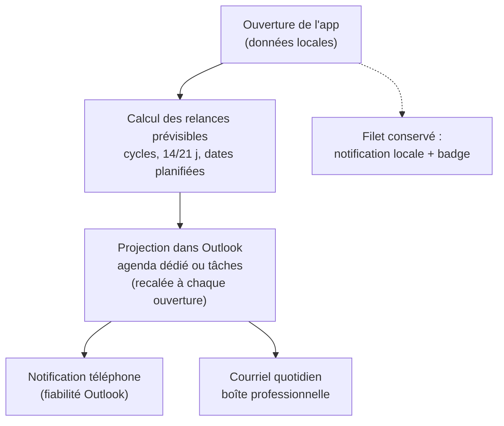
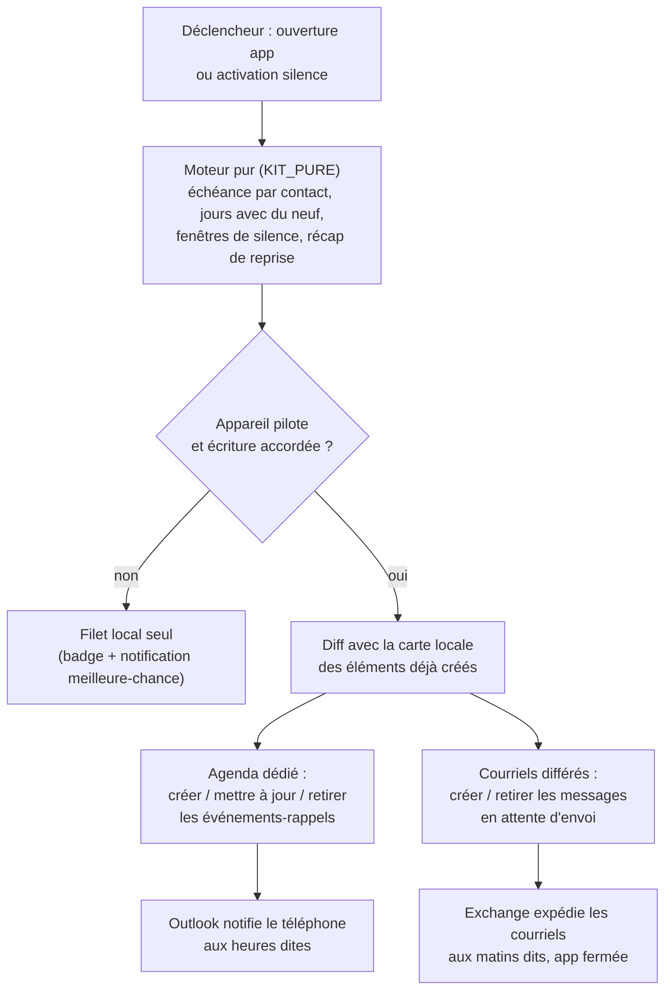

# Rappels effectifs - Plan

## Goal Capsule

- **Objectif :** que l'utilisateur soit prévenu chaque jour utile — sur son téléphone et dans sa boîte mail professionnelle — des contacts à relancer, sans dépendre d'un moment creux ni d'un réveil hasardeux de l'app. Ce plan possède ce seul chantier ; les chantiers voisins du tour d'horizon (du-oui-au-rendez-vous, coffre OneDrive) ne sont pas en périmètre actif.
- **Autorité :** le Product Contract (R-IDs) fait foi sur le comportement produit ; les KTD font foi sur les mécanismes dans les limites des R qu'ils citent. Les décisions marquées `session-settled` ne sont pas à rediscuter.
- **Profil d'exécution :** `execution: code`. Le spike tenant (fin de U2) est un point d'arrêt : il valide les deux mécanismes externes (notification Android d'un agenda secondaire, courriel différé) avant d'investir dans U3-U4.
- **Conditions d'arrêt (portes par mécanisme) :** si le consentement admin des nouveaux scopes échoue durablement, livrer U1 seul (moteur testé) et signaler le blocage — le filet local existant reste le comportement courant. Si le spike invalide la notification d'agenda secondaire, **suspendre U3 seul** et rapporter (bascule To-Do envisageable mais non décidée ici) — U4 se livre si son spike est vert, le courriel devenant le canal principal en attendant. Si le spike invalide le courriel différé, appliquer le repli du KTD3 sans s'arrêter, en signalant la dégradation de R6 dans la Definition of Done.
- **Note de préservation du contrat produit :** Product Contract inchangé ; la sous-section « Outstanding Questions — Deferred to Planning » a été résolue en place dans le Planning Contract (KTD1, KTD3, réglages par défaut) et remplacée par les différés d'implémentation.

---

## Product Contract

### Summary

L'app projette à l'avance les relances prévisibles dans l'Outlook de l'utilisateur (agenda dédié ou tâches), et c'est Outlook — le canal dont la fiabilité est prouvée chez lui — qui porte la notification téléphone et le courriel quotidien, uniquement les jours où il y a du neuf. La notification locale existante reste en double filet, et tout se tait pendant les périodes neutralisées.

### Problem Frame

L'utilisateur enchaîne les activités et ne consulte l'app qu'aux moments creux : des relances qu'il aurait faites volontiers passent à la trappe, notamment les fenêtres courtes (14 jours après une invitation restée sans réponse). L'ébauche existante — notification locale déclenchée par un réveil périodique Android — est « meilleur effort » par conception : le système peut l'espacer ou ne jamais la déclencher, et une app fermée ne peut pas écrire de courriel. Le canal qui atteint réellement l'utilisateur est connu : les notifications Outlook sur son téléphone, puis sa boîte mail professionnelle.

### Key Decisions

- **La fiabilité vient d'Outlook, pas d'un réveil de l'app : projection anticipée des relances dans le tenant M365 de l'utilisateur.** (session-settled: user-approved — chosen over la PWA renforcée seule (réveil jamais garanti, pas de courriel possible) et la projection sans filet : l'hybride conserve l'existant pour un coût quasi nul.) Toutes les échéances sont calculables à l'avance (cycles, fenêtres 14/21 jours, dates planifiées), donc plantables comme rappels datés avant qu'elles n'arrivent. Governs R1, R3, R5, R6.
- **Les noms des contacts sont visibles dans le rappel, y compris sur écran verrouillé.** (session-settled: user-directed — chosen over compteurs seuls ou prénoms seuls : lisibilité immédiate assumée au détriment de la discrétion d'écran.) Governs R2.
- **Rythme quotidien « seulement s'il y a du neuf ».** (session-settled: user-directed — chosen over récap hebdomadaire, alertes au fil de l'eau et double rythme : colle aux fenêtres de 14 jours sans rejoindre le bruit ambiant.) Governs R4.
- **Les périodes neutralisées du moteur de dates valent aussi pour les rappels, complétées d'un silence manuel à échéance.** (session-settled: user-approved — proposé en dialogue et confirmé : ces périodes correspondent aux congés, relancer n'y a pas de sens.) Governs R8, R9, R10.
- **Aucune donnée de contact hors du tenant M365 de l'utilisateur et de l'appareil.** (session-settled: user-directed — acquis du chantier geste d'invitation, reconduit : pas de serveur tiers, jamais.) Governs R7.

### Requirements

**Projection Outlook**

- R1. À chaque utilisation de l'app avec agenda connecté, les relances prévisibles des semaines à venir sont projetées dans l'Outlook de l'utilisateur sous forme de rappels datés au matin (heure réglable) des seuls jours où il y a du neuf.
- R2. Chaque rappel projeté nomme les contacts à relancer et contient un lien ouvrant Keep In Touch.
- R3. La projection se recale à chaque utilisation : un contact relancé entre-temps voit son rappel retiré ou mis à jour avant son échéance.
- R4. Un jour sans nouveauté ne porte aucun rappel — jamais de rappel vide.

**Canaux**

- R5. La notification téléphone passe par les rappels Outlook ; la notification locale existante et le badge de l'app sont conservés en filet, sans garantie propre.
- R6. Les jours avec du neuf, un courriel arrive dans la boîte professionnelle de l'utilisateur, nommant les contacts à relancer ; le mécanisme est laissé à la planification sous la contrainte R7.
- R7. Aucune donnée de contact ne transite hors de l'appareil et du tenant M365 de l'utilisateur.

**Périodes neutralisées**

- R8. Aucun rappel — notification ni courriel — pendant les semaines entièrement en août et du 24 décembre au 2 janvier, suivant les mêmes réglages d'exclusion que le moteur de dates.
- R9. L'utilisateur peut couper tous les rappels jusqu'à une date de son choix (« silence jusqu'au… ») ; la reprise est automatique à l'échéance.
- R10. Au retour d'une période de silence, le premier rappel récapitule l'accumulé en une fois — pas de rattrapage jour par jour.

**Connexion et repli**

- R11. La permission d'écriture Microsoft est demandée dans la continuité de la connexion agenda existante ; tant qu'elle n'est pas accordée, l'app reste pleinement utilisable et le filet local (notification meilleure-chance + badge) continue seul.

### Key Flows

- F1. Projection au fil de l'usage
  - **Trigger :** l'utilisateur ouvre ou utilise l'app, agenda connecté.
  - **Steps :** calcul des échéances prévisibles ; création, mise à jour et retrait des rappels dans l'espace Outlook dédié ; les jours neutralisés (R8, R9) ne reçoivent rien.
  - **Covers :** R1, R3, R4, R8, R9.
- F2. Matin avec du neuf
  - **Trigger :** un rappel projeté atteint son échéance.
  - **Steps :** Outlook notifie sur le téléphone (noms visibles) ; le courriel du jour arrive dans la boîte professionnelle ; toucher le rappel ouvre l'élément Outlook, dont le lien mène à Keep In Touch, vue « À suivre ».
  - **Covers :** R2, R5, R6.
- F3. Silence et reprise
  - **Trigger :** l'utilisateur active « silence jusqu'au [date] » avant ses congés.
  - **Steps :** aucune projection ni courriel jusqu'à l'échéance ; au premier jour de reprise, un rappel unique récapitule tout l'accumulé.
  - **Covers :** R9, R10.

### Acceptance Examples

- AE1. **Covers R1, R2, R5.** Given un contact dont le cycle échoit mardi et l'app ouverte lundi, when mardi à l'heure réglée, then le téléphone affiche un rappel Outlook nommant le contact, dont l'élément contient un lien vers l'app.
- AE2. **Covers R3.** Given un rappel projeté pour jeudi, when le contact est relancé mercredi dans l'app (app ouverte à cette occasion), then jeudi ne porte plus ce rappel.
- AE3. **Covers R4.** Given une semaine sans aucune échéance, then aucun rappel ni courriel de la semaine.
- AE4. **Covers R8.** Given des relances théoriquement dues le 12 août (semaine pleine d'août), then ni notification ni courriel ce jour-là.
- AE5. **Covers R9, R10.** Given « silence jusqu'au 15 septembre » activé le 1er août, when le 15 septembre arrive, then un rappel unique récapitule tous les contacts accumulés depuis le 1er août.
- AE6. **Covers R6.** Given trois contacts à relancer un mardi, then le courriel du mardi dans la boîte professionnelle nomme les trois contacts.
- AE7. **Covers R11.** Given la permission d'écriture refusée ou pas encore accordée, then l'app fonctionne intégralement et seul le filet local subsiste.

### Success Criteria

- Sur deux semaines d'usage réel hors périodes neutralisées, chaque jour comptant au moins une relance due produit au moins un signal effectivement vu sur le téléphone — l'utilisateur ne découvre plus de relance « trop tard ».
- Zéro rappel reçu pendant une période neutralisée ou un silence manuel.

### Scope Boundaries

- Notifications PC natives (jugées peu lisibles), alertes au fil de l'eau et récapitulatif hebdomadaire — écartés en dialogue.
- Envoi de courriels aux contacts eux-mêmes : jamais en périmètre (les rappels ne s'adressent qu'à l'utilisateur).
- Synchronisation retour Outlook vers app (marquer « fait » depuis le rappel) : hors v1, la projection est à sens unique.
- Support iOS : l'utilisateur est sur Android ; la voie Outlook fonctionne partout par nature, sans travail dédié.
- Projection multi-appareils : un seul appareil pilote les rappels Outlook en v1 (KTD4) ; la réconciliation inter-appareils est différée.

### Dependencies / Assumptions

- Consentement administrateur probable pour les permissions d'écriture (agenda + courriel) — le prestataire IT connaît désormais la procédure (affectation + consentement, Phase B du geste d'invitation) ; les deux scopes sont demandés en un seul passage (KTD2).
- Les notifications Outlook atteignent fiablement le téléphone de l'utilisateur — fondement du choix, constaté par lui ; la déclinaison « agenda secondaire » est vérifiée par le spike (U2).
- Fondation Microsoft en place : connexion MSAL (`index.html`, module `KIT_AGENDA`) ; aucune écriture Graph dans le code actuel (vérifié le 2026-07-31).
- La fraîcheur de la projection est bornée par le rythme d'ouverture de l'app ; jugé acceptable, l'app étant le poste de travail relationnel quotidien de l'utilisateur.

### Sources / Research

- Ébauche existante : réveil périodique et notification locale (`sw.js:157-168`), calcul des relances dues (`sw.js:105-122`), miroir IndexedDB lu par le service worker (`sw.js:131-144`), activation côté app avec intervalle minimal 24 h (`index.html:1375-1386`).
- Réglages d'exclusion réutilisés par R8 : `exclusions.aoutPlein` / `exclusions.fetesFinAnnee` (`index.html:569`), édités dans le panneau Rencontres & agenda.
- Champs de cycle et fenêtres : `FOLLOWUP_DAYS = 14`, `FOLLOWUP_RETRY_DAYS = 21` (`index.html:730-731`), `snoozedUntil`, `awaitingUntil`, `followUpDate` ; calcul « dû aujourd'hui » : `computeDue` (`index.html:754-771`), dupliqué par convention dans `sw.js` (`_computeDue`).
- Fondation Microsoft : `KIT_AGENDA` (`index.html:254-411`), scope actuel `Calendars.ReadBasic` (`index.html:256`) ; seule requête Graph existante : lecture `calendarView`.
- Recherche externe (2026-07-31) : propriétés d'événement Graph (`isReminderOn`, `reminderMinutesBeforeStart`, `transactionId`) ; To-Do (`todoTask.reminderDateTime`) notifie via l'app To-Do, pas Outlook ; le courriel d'agenda natif (Cortana Briefing) est retiré sans successeur ; envoi différé via `singleValueExtendedProperties` `SystemTime 0x3FEF` (PidTagDeferredSendTime) — mécanisme serveur réel mais peu documenté officiellement ; consentement incrémental MSAL : un scope ajouté au manifeste exige un nouveau consentement admin (AADSTS65001 sinon).
- Toutes les affirmations locales vérifiées contre le code le 2026-07-31.

<!-- ce-section: work-relationships -->
### How This Work Fits Together

Ce plan possède le chantier « rappels effectifs » seul. La compréhension actuelle des chantiers voisins — indicative, non engageante :

- Du-oui-au-rendez-vous (journaliser la rencontre quand un invité répond oui)
  - **Can proceed independently of** ce plan ; **Shares** la fondation Microsoft.
- Coffre OneDrive (sauvegarde chiffrée automatique)
  - **Can proceed independently of** ce plan ; **Shares** la connexion MSAL, avec un scope propre.
- Geste d'invitation (livré) : **Enables** ce plan — la fondation MSAL et les périodes d'exclusion qu'il a posées sont réutilisées ici (`docs/plans/2026-07-29-001-feat-geste-invitation-plan.md`).

---

## Planning Contract

### Key Technical Decisions

- KTD1. **Réceptacle : agenda Outlook dédié « Keep In Touch », événements avec rappel — pas To-Do.** (session-settled: user-approved — chosen over les tâches Microsoft To-Do : leurs rappels notifient via l'app To-Do, que l'utilisateur n'utilise pas, quand les rappels d'agenda notifient via Outlook, son canal prouvé ; suppression propre triviale en supprimant l'agenda entier.) Propriétés : `isReminderOn`, `reminderMinutesBeforeStart` (rappel à l'heure exacte de l'événement : minutes = 0), sujet « Relancer : {prénoms noms} », corps avec le lien `https://lupuriel.github.io/keepintouch/` et le détail par contact. Fiabilité de la notification Android pour un agenda **secondaire** non documentée par Microsoft : le spike (U2) la vérifie avant tout investissement U3. Governs R1, R2, R5.
- KTD2. **Scopes séparés lecture/écriture : la lecture garde `["Calendars.ReadBasic"]`, l'écriture demande `["Calendars.ReadWrite", "Mail.Send"]` en un seul passage admin.** (session-settled: user-approved — chosen over le remplacement du tableau `SCOPES` unique : un remplacement ferait échouer `acquireTokenSilent` en `consent_required` sur TOUS les appareils dès le déploiement, cassant la lecture de dates du geste d'invitation jusqu'au re-consentement.) Deux jeux de scopes dans `KIT_AGENDA` : le chemin de lecture existant (`getToken`) reste sur le jeu actuel — son consentement admin survit à l'ajout de scopes au manifeste — et un nouveau chemin `getWriteToken` demande le jeu d'écriture (silencieux puis, sur action utilisateur, interactif). Le consentement des nouveaux scopes se fait en un aller-retour prestataire (`/adminconsent`, sinon `AADSTS65001`) ; en attendant, seuls les rappels Outlook sont indisponibles, tout le reste fonctionne. `Mail.Send` n'est utilisé que vers l'adresse de l'utilisateur lui-même (R7). Governs R6, R11.
- KTD3. **Courriel quotidien : messages à envoi différé, plantés à l'avance.** (session-settled: user-approved — tradeoff exposé : technique réelle côté serveur Exchange mais peu documentée officiellement.) Création via `POST /me/messages` avec `Prefer: IdType="ImmutableId"` (les ids Graph par défaut changent quand le message change de dossier — l'id immuable garantit la rétractation) + `singleValueExtendedProperties` `[{id: "SystemTime 0x3FEF", value: <UTC ISO>}]` (PidTagDeferredSendTime) puis envoi : le message attend dans la boîte et le transport Exchange l'expédie à l'heure dite, app fermée. **L'instant UTC est dérivé des règles Europe/Paris pour la date cible** (résolution d'offset par date, fonction pure testée aux deux changements d'heure) — jamais l'offset courant de l'appareil. Retirer un courriel = supprimer le message différé encore en attente par son id immuable, avec recherche défensive par objet déterministe avant de conclure « déjà parti ». Corps en `contentType: "text"` — les chaînes issues des contacts ne sont jamais interprétées comme balisage. **Repli si le spike déçoit :** récapitulatif envoyé immédiatement à la première ouverture d'un jour avec du neuf (dégradé, app-dépendante — la Definition of Done le signale comme dégradation de R6 à re-valider avec l'utilisateur) + procédure Power Automate documentée dans le LISEZMOI en **documentation seule, hors périmètre de construction**. Governs R6.
- KTD4. **Un seul appareil pilote la projection (v1), identité matérialisée côté tenant.** (session-settled: user-directed — chosen over la projection multi-appareils réconciliée : les données PC/Android sont indépendantes et les ids de contacts divergent entre fusions, des doublons Outlook seraient garantis.) Un drapeau local seul ne peut pas garantir l'unicité (revue : deux appareils peuvent se croire pilotes, aucun canal ne transporte la passivation) : **le marqueur pilote vit sur l'agenda dédié lui-même** (extension ouverte Graph portant un id d'appareil), et chaque passe le vérifie avant d'écrire — marqueur d'un autre appareil → passage passif immédiat. L'activation n'est jamais automatique-silencieuse : elle a lieu sur l'action utilisateur explicite qui déclenche la connexion d'écriture sur cet appareil, marqueur absent ou réclamé sciemment (« Reprendre le pilotage ici » réécrit le marqueur ; l'ancien pilote se passive à sa passe suivante en lisant le marqueur). Le drapeau local (magasin d'appareil, motif `pendingInvites`) n'est qu'un cache. Filet anti-doublon complémentaire : **la clé d'unicité est la date dans l'agenda dédié** — un seul élément par jour, retrouvé par `calendarView` du jour + préfixe de sujet « Relancer : », jamais par le sujet complet (la liste de noms change) — plus carte locale des ids Graph créés. Governs R1, R3.
- KTD5. **Silence et reprise : calcul anticipé, rétractation garantie à retour visible, jour de reprise résolu.** L'activation du silence déclenche immédiatement une passe de rétractation (rappels et courriels de la fenêtre) puis le plantage du récapitulatif de reprise — calculable à l'avance puisque les échéances sont déterministes ; **la fenêtre de silence est balayée jusqu'au jour de reprise quel que soit l'horizon de projection** (l'horizon de 28 jours ne borne que les entrées quotidiennes ordinaires, sinon AE5 est infaisable). La rétractation est la seule passe **à retour visible** : confirmation « rappels retirés jusqu'au [date] » ou message d'échec avec bouton Réessayer ; l'intention de silence est **persistée** dans le magasin local et la rétractation retentée à chaque déclencheur jusqu'à confirmation Outlook (un échec réseau juste avant les congés ne peut pas laisser partir les rappels en silence supposé) ; sur un appareil non-pilote, l'UI avertit que les rappels déjà plantés ne seront retirés qu'à la prochaine ouverture de l'appareil pilote. Rafraîchi à toute ouverture ultérieure (les changements postérieurs n'y figurent pas, accepté en dialogue). Jour de reprise = premier jour ouvré non exclu (R8) à partir de l'échéance du silence. Le **filet local respecte aussi** silence et exclusions : le contrôle pur s'ajoute à `computeDue` (`index.html:754`) et à son double `_computeDue` (`sw.js:105`) — duplication assumée, convention existante du service worker. Governs R8, R9, R10, et l'aspect filet de R5.
- KTD6. **Toute écriture datée utilise le fuseau nommé (`Romance Standard Time`), jamais l'offset numérique de l'appareil.** Un rappel planté des semaines à l'avance avec un offset figé dériverait d'une heure au changement d'heure ; le chemin de lecture utilise déjà le fuseau nommé (`Prefer: outlook.timezone`, `index.html:450`) — même convention en écriture (`start`/`end` avec `timeZone`). Governs R1.
- KTD7. **Cycle de vie du réceptacle : identité par id, détection-recréation avertie, purge complète à la déconnexion.** Les opérations destructives se lient d'abord au `calendarId` stocké — **jamais de suppression d'un agenda retrouvé par son seul nom** : quand la résolution passe par le nom (`GET /me/calendars` + `$filter`), la suppression n'est permise que si tous ses événements portent le préfixe de sujet de l'app, et s'arrête (fail-closed) sur ambiguïté ou homonymie. Agenda recréé s'il a été supprimé côté Outlook (404 ou absent), avec **invite après recréation** : « vérifiez que l'agenda Keep In Touch est coché dans Outlook » (un agenda secondaire recréé peut devoir être re-coché pour notifier). La déconnexion propose « Supprimer aussi les rappels Keep In Touch d'Outlook ? » — sur oui : suppression de l'agenda dédié, des courriels différés en attente **et** des récapitulatifs déjà livrés (recherche par l'objet déterministe), avant la purge locale du cache ; le LISEZMOI note que les politiques de rétention du cabinet peuvent en conserver des copies. Sur non ou échec : purge locale seule, et la carte `data.outlookRappels` est **préservée en état « déconnecté »** pour que la reconnexion réconcilie l'existant — elle n'est réinitialisée qu'après purge Outlook réussie. Consentement révoqué de l'extérieur : purge impossible, résidu documenté. Governs R11.

### High-Level Technical Design

Cycle d'une passe de projection (à chaque ouverture d'app et à l'activation du silence) :

Le moteur pur (nouvelles fonctions `KIT_PURE`) est la seule source des dates : `nextDueDate(contact, today)` reproduit la préséance exacte de `computeDue` (parqué > snoozé > sans-réponse 14 j > relance 21 j > date planifiée > cycle), `projectionDays(contacts, settings, today)` regroupe par jour et applique silence + exclusions, `resumeDay(settings, today)` résout le jour de reprise. Les enveloppes impures (Graph) ne calculent rien.

### System-Wide Impact

- **Transition de permissions sans régression (KTD2).** La séparation lecture/écriture garantit que la lecture de dates du geste d'invitation continue de fonctionner pendant l'attente du re-consentement admin ; le spike (U2) vérifie que l'erreur réelle de consentement se classe bien en « consentement-requis » et non en « interaction » (sinon `silent(account, true)` au démarrage renverrait l'utilisateur vers la page « Approbation nécessaire » de Microsoft à chaque ouverture — garde à poser), **et vérifie, juste après la modification du manifeste Entra et avant le consentement, que la lecture `Calendars.ReadBasic` fonctionne toujours sur un appareil connecté** (seul maillon de KTD2 non prouvé).
- **R3 ne voit que l'appareil pilote jusqu'à fusion.** Une relance journalisée sur l'appareil non-pilote ne rétracte pas le rappel planté par le pilote : le téléphone peut sonner pour un contact déjà relancé ailleurs — conséquence assumée de KTD4 (données par appareil, fusions manuelles), énoncée ici, documentée au LISEZMOI et figée par un test U3.
- **Déclencheurs de la passe de projection.** « À chaque ouverture » ne suffit pas : une PWA Android reprend depuis la mémoire sans rechargement pendant des jours. Déclencheurs = montage + retour au premier plan (`visibilitychange`, throttlé — motif des deux listeners existants, `index.html:1279-1285` et `3698-3700`) + après une journalisation d'interaction. Sans cela, R3/AE2 échouent dans le cas le plus courant.
- **Écritures du magasin local pendant une passe asynchrone.** La passe traverse de nombreux `await` Graph : toute écriture de `data.outlookRappels` passe par le chemin fonctionnel de `save` (`setData(prev => …)`, `index.html:1321-1327`) — jamais le mode verify, qui réécrirait l'objet `data` entier depuis une fermeture périmée et écraserait une édition utilisateur faite pendant la passe.
- **Filet local et sémantique « jour sans neuf ».** La notification locale compte le **stock** (`info.total > 0`, `sw.js:145-155`), pas le « neuf du jour » : un jour sans nouveauté avec du retard accumulé peut produire la notification locale de comptage. Le critère « jour sans neuf → rien » se mesure sur les canaux Outlook ; la double notification des matins normaux est la redondance voulue (R5).
- **Silence et fusion des réglages.** `settings` fusionne en bloc au `updatedAt` le plus récent (`index.html:679`) : une fusion depuis un appareil dont les réglages sont plus récents peut annuler un silence actif — accepté (mono-utilisateur, fusions rares), testé et documenté (U5). Le filet local du second appareil n'apprend le silence qu'à sa propre synchronisation — documenté comme comportement par-appareil.
- **Sauvegardes JSON.** Les magasins locaux d'appareil (`pendingInvites` aujourd'hui, `outlookRappels` demain) figurent dans le fichier de sauvegarde mais ne sont **jamais réappliqués** par restauration ni fusion (`restorePartial` liste blanche, `index.html:1942-1944` ; `mergeData` ne les retourne pas, `index.html:689`) — garde testée en U3. Contenu bénin (ids Graph opaques).
- **Boîte d'envoi visible.** Jusqu'à ~28 courriels différés attendent visiblement dans la boîte (brouillons/boîte d'envoi) ; une suppression manuelle y est tolérée (DELETE 404 = déjà parti) ; noté au LISEZMOI. Première passe potentiellement longue (30-60 s mobile) — non bloquante par construction.

### Assumptions

- Le tenant du cabinet acceptera les deux scopes après passage admin — le chemin (affectation + consentement) est éprouvé depuis la Phase B.
- L'heure de rappel par défaut est 08:30, réglable (`settings.rappels.heure`) ; horizon de projection par défaut : 28 jours glissants, aligné sur l'horizon du moteur de dates.
- L'utilisateur vit à l'heure française ; le fuseau nommé (KTD6) couvre les déplacements ponctuels.

---

## Implementation Units

### U1. Moteur pur de projection et de silence

- **Goal :** toutes les dates du chantier calculées par des fonctions pures testées — échéance par contact, jours avec du neuf, fenêtres de silence, jour de reprise, contenu du récapitulatif.
- **Requirements :** R1, R3, R4, R8, R9, R10 ; KTD5.
- **Dependencies :** aucune.
- **Files :** `index.html` (KIT_PURE + KIT_TESTS), `scripts/kit-tests-node.js` (nouveau — runner node minimal extrayant les scripts non-Babel d'`index.html` et les fonctions pures de `sw.js`, référencé par la porte « Harnais » et U5).
- **Approach :**
  1. `nextDueDate(contact, today)` : reproduit la préséance de `computeDue` (`index.html:754-771`) champ à champ — `awaitingUntil` (parqué) prime, puis fenêtre sans-réponse (`latestInteraction.date` + 14 j), relance (+ 21 j), `followUpDate` verbatim, cycle (`lastRencontre` + `cycleFor().due` mois — nouvel utilitaire `addMonthsISO(isoDate, n)`, `snoozedUntil` respecté). Retourne date + motif.
  2. `projectionDays(contacts, settings, today)` : regroupe les échéances par jour sur l'horizon, écarte les jours sans neuf (R4), applique exclusions R8 + `silenceUntil` (R9) ; les échéances tombant en fenêtre de silence s'accumulent sur le jour de reprise (`resumeDay`) en une entrée récapitulative (R10).
  3. `quietToday(settings, today)` : prédicat unique partagé consommé par le filet local (KTD5) — exporté de `KIT_PURE` et recopié dans `sw.js` selon la convention du fichier.
  4. Enregistrer les cas au harnais, rouge d'abord.
- **Patterns to follow :** style `candidateDates` et helpers U6 du geste d'invitation (`index.html:99-197`) ; dates en chaînes ISO, `Date.UTC` uniquement pour l'arithmétique.
- **Execution note :** proof-first — chaque fonction naît avec son cas rouge ; vérifier l'équivalence de préséance contre `computeDue` sur des fixtures communes.
- **Test scenarios :**
  - Préséance : contact parqué jusqu'à J+10 → échéance J+10, pas le cycle ; sans-réponse du 1er → échéance le 15 ; relance armée le 1er → le 22 ; `followUpDate` verbatim ; cycle 12 mois depuis `lastRencontre` (fin de mois : 31 janvier + 1 mois → 28/29 février) ; `snoozedUntil` repousse ; `priority: "none"` → jamais d'échéance.
  - Covers AE3. Semaine sans échéance → `projectionDays` vide.
  - Covers AE4. Échéance un 12 août (semaine pleine, `aoutPlein`) → reportée au jour de reprise, pas de jour propre.
  - Covers AE5. Silence du 1er août au 15 septembre : échéances des 5 août et 2 septembre → une seule entrée récapitulative au premier jour ouvré non exclu ≥ 15 septembre, listant les deux contacts.
  - Jour de reprise en collision : silence jusqu'au 27 décembre → reprise reportée après le 2 janvier (premier jour ouvré).
  - Reprise au-delà de l'horizon : silence du 1er août au 15 septembre avec horizon 28 jours → le récapitulatif du jour de reprise existe et liste les échéances du 5 août ET du 2 septembre (la fenêtre de silence n'est pas bornée par l'horizon).
  - Conversion différé : instant UTC pour « 08:30 » un 15 janvier (hiver, +01:00) et un 15 juillet (été, +02:00) — deux résultats distincts corrects.
  - `silenceUntil` dans le passé ou aujourd'hui → aucun effet (projection normale).
  - Deux contacts échéant le même jour → une entrée de jour, deux noms.
  - `quietToday` : vrai en semaine pleine d'août, vrai sous silence manuel, faux sinon.
- **Verification :** `KIT_TESTS.run()` sans échec (console ou node) ; les 42 cas antérieurs restent verts.

### U2. Permissions élargies, état de reconnexion et spike tenant

- **Goal :** l'app demande les scopes d'écriture en un passage, guide la reconnexion, et le spike valide les deux mécanismes externes avant U3-U4.
- **Requirements :** R11 ; KTD1 (validation), KTD2, KTD3 (validation).
- **Dependencies :** aucune (parallèle à U1).
- **Files :** `index.html`, `LISEZMOI.txt`.
- **Approach :**
  1. Scopes séparés (KTD2) : le jeu de lecture actuel reste tel quel (`index.html:256, 327, 333`) ; nouveau chemin `getWriteToken(done)` dans `KIT_AGENDA` demandant `["Calendars.ReadWrite", "Mail.Send"]` — silencieux d'abord, interactif seulement sur action utilisateur explicite (bouton du bloc réglages) ; garde anti-boucle : jamais de redirect automatique au démarrage pour le jeu d'écriture (System-Wide Impact).
  2. Bloc réglages (`index.html:3372-3393`) : l'état `consentement-requis` couvre le cas ; libellé enrichi « Nouvelles autorisations à approuver (agenda + courriel) — transmettez le message du guide à votre administrateur » ; bouton Réessayer inchangé.
  3. LISEZMOI : message prestataire actualisé (deux scopes, même lien `/adminconsent`).
  4. **Spike tenant (point d'arrêt du plan, fidélité production)** : depuis la console du navigateur connecté —
     a. vérifier, juste après l'ajout des scopes au manifeste Entra et avant le consentement, que la lecture `Calendars.ReadBasic` fonctionne toujours (System-Wide Impact) ;
     b. créer un agenda « Keep In Touch (test) » et y poser un événement **avec la charge réelle de U3** (fuseau nommé, rappel à 0 min, sujet préfixé) à T+10 min → **notification Android réelle** constatée ;
     c. supprimer puis recréer l'agenda test → constater si l'agenda recréé notifie sans geste manuel (sinon KTD7 garde son invite) ;
     d. créer un message différé à T+10 min, app fermée → réception constatée ; en créer un second puis le **supprimer avant échéance** → non-réception constatée ; noter le dossier où attendent les différés et si la suppression proche de l'échéance passe ;
     e. créer un différé à horizon d'au moins une nuit (idéalement T+3 jours, en parallèle de U1) → réception à l'heure dite ;
     f. nettoyer et consigner l'ensemble. KTD1/KTD3 ne s'exécutent en U3/U4 qu'après spike vert (repli KTD3 sinon ; portes par mécanisme : spike agenda rouge → suspendre U3 seul et rapporter ; spike courriel vert → U4 se livre, le courriel devenant canal principal en attendant).
- **Patterns to follow :** gestion d'état `KIT_AGENDA` existante (`classifyMsalError`, bloc réglages).
- **Test scenarios :**
  - Covers AE7. Scopes non consentis : `acquireTokenSilent` échoue en `consent_required` → état « consentement-requis », app pleinement utilisable, aucun appel d'écriture tenté.
  - `classifyMsalError` inchangé sur les cas existants (les 4 cas du harnais restent verts).
  - Test expectation: le spike est une vérification manuelle consignée — pas de cas de harnais.
- **Verification :** compilation Babel ; reconnexion réelle avec les deux scopes après consentement admin ; spike consigné (deux mécanismes verts, ou repli acté).

### U3. Écriture agenda : projection, recalage, cycle de vie

- **Goal :** la passe de projection matérialise le plan du moteur pur dans l'agenda dédié — créer, mettre à jour, retirer — de façon idempotente sur l'appareil pilote.
- **Requirements :** R1, R2, R3, R4 ; KTD1, KTD4, KTD6, KTD7.
- **Dependencies :** U1, U2 (spike vert).
- **Files :** `index.html`.
- **Approach :**
  1. Magasin local d'appareil `data.outlookRappels` (motif `pendingInvites` : jamais dans `mergeData`, jamais dans `MERGE_FIELDS`) : `{ pilote: bool, calendarId, heure, silenceEnAttente, items: { "YYYY-MM-DD": eventId, ... }, mails: { "YYYY-MM-DD": messageId, ... } }`.
  2. Passe de projection — déclencheurs : montage, retour au premier plan (`visibilitychange` throttlé), après journalisation d'interaction, activation du silence (System-Wide Impact) — avec **garde single-flight** : jamais deux passes simultanées ; un déclencheur pendant une passe note une relance et une unique passe de rattrapage repart à la fin (le contrôle-puis-création traversé d'`await` serait sinon une course à doublons).
  3. Corps de la passe : vérifier le **marqueur pilote côté tenant** (KTD4 — mismatch → passage passif) ; retrouver/créer l'agenda dédié par `calendarId` puis nom (KTD7) ; diff `projectionDays` contre `items` : créer les jours nouveaux (événement à `heure`, fuseau nommé KTD6, rappel à 0 min, sujet préfixé « Relancer : {noms} », corps `text` détaillé + lien `#suivre`), mettre à jour les jours dont la liste ou l'`heure` a changé (une modification de `settings.rappels.heure` se propage à tous les éléments futurs, puis `outlookRappels.heure` est réécrit), supprimer les jours disparus ; unicité par **jour** : `calendarView` du jour + préfixe de sujet avant toute création (KTD4 — jamais le sujet complet).
  4. Échecs réseau/HTTP : passe abandonnée sans bloquer, retentée au prochain déclencheur ; 404 d'agenda → recréation (avec l'invite KTD7) puis re-projection complète.
- **Patterns to follow :** enveloppe réseau de `fetchCandidateDates` (`index.html:419-460`) — AbortController + délai, jamais d'exception non rattrapée ; écritures du magasin local par le chemin **fonctionnel** de `save` (`setData(prev => …)`) — jamais le mode verify à travers des `await` (System-Wide Impact).
- **Execution note :** vérification smoke-first sur l'agenda réel (KTD7) ; les fonctions de diff (plan → opérations) sont pures et rejoignent le harnais ; chaque entrée de carte n'est écrite qu'après succès de l'opération Graph correspondante.
- **Test scenarios :**
  - Diff pur : plan {lundi: A,B} contre carte {lundi: id1 (A seul)} → une mise à jour ; carte {mardi: id2} sans plan mardi → une suppression ; plan {mercredi} sans carte → une création.
  - Covers AE1 (checklist réelle) : contact échéant mardi, app ouverte lundi → événement présent mardi 08:30 dans l'agenda dédié, notification reçue.
  - Covers AE2 (checklist réelle) : relance mercredi → l'événement de jeudi disparaît d'Outlook.
  - Appareil non pilote : aucune écriture tentée (garde testée en pur).
  - Échec réseau en milieu de passe → carte locale cohérente (l'entrée n'est enregistrée qu'après succès de l'opération Graph).
  - Restauration et fusion : `outlookRappels` jamais réappliqué (garde sur `restorePartial`/`mergeData`, motif `pendingInvites`).
  - Single-flight : deux déclencheurs rapprochés → une passe + une passe de rattrapage, jamais deux simultanées (testé en pur sur le séquenceur).
  - Marqueur pilote : marqueur d'un autre appareil détecté → aucune écriture, état passif affiché (testé en pur sur le prédicat).
  - R3 par-appareil : relance journalisée sur le non-pilote → rappel non rétracté jusqu'à fusion — test qui constate et fige cette sémantique (System-Wide Impact).
  - Changement d'heure : `settings.rappels.heure` modifiée → tous les éléments futurs mis à jour à la passe suivante.
- **Verification :** checklist réelle sur l'agenda de l'utilisateur — deux matins consécutifs conformes (AE1), recalage constaté (AE2) ; `KIT_TESTS.run()` sans échec.

### U4. Courriels différés

- **Goal :** chaque jour avec du neuf reçoit son courriel, expédié par Exchange à l'heure dite même app fermée.
- **Requirements :** R6, R7 ; KTD3, KTD4.
- **Dependencies :** U2 (spike vert), U3 (plomberie de passe et magasin local).
- **Files :** `index.html`.
- **Approach :** même diff que U3 sur `mails` : créer un message différé (`SystemTime 0x3FEF` à la date-heure du jour, destinataire = l'utilisateur, objet « Keep In Touch — relances du {date} », corps noms + lien) pour chaque jour nouveau ; supprimer le message en attente pour chaque jour retiré (DELETE 404 = déjà parti ou supprimé à la main, toléré) ; anti-doublon symétrique de U3 : recherche des messages en attente par objet déterministe avant création (une passe interrompue après création mais avant écriture de la carte ne crée pas de second courriel) ; en repli KTD3 (spike rouge), envoi immédiat au premier passage d'un jour avec du neuf, même contenu.
- **Patterns to follow :** enveloppe réseau U3.
- **Test scenarios :**
  - Diff pur mails : mêmes cas que U3 (création/suppression par jour).
  - Covers AE6 (checklist réelle) : trois contacts un mardi → courriel du mardi les nommant, reçu app fermée.
  - Retrait : contact relancé la veille → le courriel différé du lendemain est supprimé avant envoi (vérifiable dans le dossier d'attente).
  - Destinataire strictement égal à l'adresse du compte connecté (garde testée en pur).
- **Verification :** checklist réelle (AE6 + retrait) ; aucun courriel un jour sans neuf.

### U5. Silence, périodes neutralisées et filet local

- **Goal :** le silence se règle en un geste, agit immédiatement, et le filet local respecte les mêmes règles de quiétude.
- **Requirements :** R8, R9, R10 ; R5 (filet) ; KTD5.
- **Dependencies :** U1 (pour le code) ; U3, U4 (pour la checklist réelle seulement — le développement peut précéder).
- **Files :** `index.html`, `sw.js`, `LISEZMOI.txt`.
- **Approach :**
  1. `settings.rappels = { heure: "08:30", silenceUntil: null }` semé dans `defaultSettings`/`migrateData` (fusion couverte par `updatedAt` global des settings).
  2. UI silence (panneau réglages, U6 pour l'emplacement) : champ date + bouton « Couper jusqu'au… » ; l'activation persiste l'intention (`silenceEnAttente` du magasin local) et déclenche la passe de rétractation **à retour visible** (confirmation « rappels retirés jusqu'au [date] » ou échec + Réessayer), retentée à chaque déclencheur jusqu'à confirmation (KTD5) ; sur appareil non-pilote, avertissement que le retrait effectif attend l'appareil pilote.
  3. Filet local : `computeDue` (`index.html:754`) et `_computeDue` (`sw.js:105`) court-circuités par `quietToday` (U1) — le badge « À suivre » reste, seule la notification se tait ; côté service worker, les réglages (`rappels`, `exclusions`) se lisent depuis le miroir IndexedDB existant (`data.settings`), aucune plomberie nouvelle.
  4. `CACHE_NAME` → `kit-crm-v36`, `APP_VERSION` → `1.5.0` (même commit) ; LISEZMOI : section rappels (usage, silence, périodes).
- **Patterns to follow :** semis idempotent des réglages (`migrateData`, KTD5 du geste d'invitation) ; duplication sw.js consciente (commentaire de correspondance de part et d'autre).
- **Test scenarios :**
  - Covers AE4/AE5 (harnais via U1 ; checklist réelle : activation du silence → les rappels de demain disparaissent d'Outlook dans la minute).
  - Migration : réglages existants sans `rappels` → semés sans écraser le reste ; sauvegarde antérieure restaurée → semis idempotent.
  - Filet : `quietToday` vrai → `_notifBody`/notification non déclenchées (fixture sw simulée sous node comme `run-kit-tests`).
  - Date de silence passée saisie → refusée ou sans effet (pas de rétractation).
  - Fusion annulant un silence : réglages importés plus récents sans `silenceUntil` → silence perdu, comportement accepté et documenté (System-Wide Impact) — le test constate et fige cette sémantique.
- **Verification :** `KIT_TESTS.run()` sans échec ; démarrage hors-ligne intact après bump (mode avion) ; toast de mise à jour reçu.

### U6. Réglages, état visible et déconnexion propre

- **Goal :** un bloc « Rappels » complet dans les réglages, l'état pilote visible, et une déconnexion qui ne laisse pas de résidu nominatif dans Outlook sans l'accord de l'utilisateur.
- **Requirements :** R2 (lien), R11 ; KTD4, KTD7.
- **Dependencies :** U3, U4, U5.
- **Files :** `index.html`, `LISEZMOI.txt`.
- **Approach :**
  1. Bloc réglages « Rappels Outlook » sous « Connecter mon agenda » : état (pilote/non-pilote/écriture absente), heure de rappel, silence (U5), dernier recalage.
  2. Déconnexion (`index.html:404-409`) : question « Supprimer aussi les rappels Keep In Touch d'Outlook ? » — sur oui, suppression de l'agenda dédié (lié au `calendarId`, fail-closed par nom — KTD7), des courriels différés en attente et des récapitulatifs livrés (objet déterministe), avant `clearCache`/purge, puis réinitialisation de la carte ; sur non ou échec, purge locale seule, note d'information, et carte **préservée en état « déconnecté »** pour réconciliation à la reconnexion (KTD7).
  3. Non-pilote : bouton « Reprendre le pilotage ici » — réécrit le **marqueur tenant** (KTD4) ; l'ancien pilote se passive à sa passe suivante en lisant le marqueur (coordination minimale via l'agenda dédié lui-même, exception bornée à la frontière multi-appareils différée).
  4. Route `#suivre` : au montage, si `location.hash === "#suivre"`, ouvrir la vue « À suivre » ; les corps d'événements et de courriels (U3/U4) utilisent `https://lupuriel.github.io/keepintouch/#suivre`.
- **Patterns to follow :** blocs réglages existants (`index.html:3372-3407`).
- **Test scenarios :**
  - Déconnexion avec refus → aucun appel Graph de suppression, purge locale intacte (les cas U5 du geste d'invitation restent verts).
  - Déconnexion avec accord (checklist réelle) → agenda dédié absent d'Outlook, courriels en attente supprimés, aucune clé `msal.*` restante.
  - Bascule pilote : drapeau local seul modifié, aucune écriture des données fusionnées.
- **Verification :** checklist réelle déconnexion ; compilation Babel ; `KIT_TESTS.run()` sans échec.

---

## Verification Contract

| Porte | Procédure | Quand |
|---|---|---|
| Harnais de fonctions pures | `KIT_TESTS.run()` en console ou sous node → 0 échec (42 cas existants + moteur de projection, diff, quiétude) | À chaque évolution de U1, U3, U4, U5 |
| Spike tenant écriture | Notification Android reçue d'un événement-rappel sur agenda secondaire créé par Graph + courriel différé reçu app fermée ; résultats consignés | Fin de U2, avant U3-U4 |
| Checklist réelle rappels | Sur le téléphone : deux matins consécutifs avec du neuf → rappel Outlook nommant les contacts + courriel reçu, **et le lien du rappel ouvre bien Keep In Touch, vue « À suivre »** ; un jour sans neuf → **aucun rappel Outlook ni courriel** (la notification locale de comptage peut subsister, sémantique de stock — System-Wide Impact) ; relance la veille → rappel et courriel du lendemain retirés ; activation silence → confirmation affichée + retrait constaté + récap au retour | Avant livraison |
| Hors-ligne & démarrage | Démarrage à froid en mode avion concluant (PC et Android) après bump v36 | Avant livraison |
| Publication | `CACHE_NAME` (kit-crm-v36) et `APP_VERSION` (1.5.0) bumpés dans le même commit ; LISEZMOI à jour (consentement deux scopes, usage rappels) ; nouvelle version visible dans « À propos » | Au déploiement GitHub Pages |

---

## Definition of Done

- R1-R11 couverts par les unités livrées ; AE1-AE7 passés (harnais ou checklist réelle).
- Spike tenant passé et consigné — ou repli KTD3 acté ; blocage rapporté si l'agenda secondaire ne notifie pas.
- Le consentement admin des deux scopes est documenté dans le LISEZMOI et a été effectué (ou son attente est signalée à la livraison).
- Aucune donnée de contact hors tenant/appareil ; les courriels ne partent que vers l'utilisateur ; la déconnexion propose la purge Outlook.
- Aucun code d'essai résiduel ; les fonctions pures du moteur de projection sont regroupées dans `KIT_PURE` et testées.
- Si le repli courriel de KTD3 est actif (spike différé rouge), R6 est signalée comme **dégradée** (courriel dépendant de l'ouverture de l'app) et cette dégradation a été explicitement re-validée avec l'utilisateur avant livraison.
- Les cinq portes du Verification Contract sont passées.

---

## Deferred to Implementation

- Formulation exacte des sujets/corps d'événements et de courriels (gabarits à caler pendant U3/U4 sur le rendu réel Outlook mobile).
- Comportement précis des erreurs Graph d'écriture (codes rencontrés au spike) et messages utilisateur associés.
- Éventuel plafond du nombre d'éléments projetés par passe (à observer ; l'horizon de 28 jours le borne naturellement).
